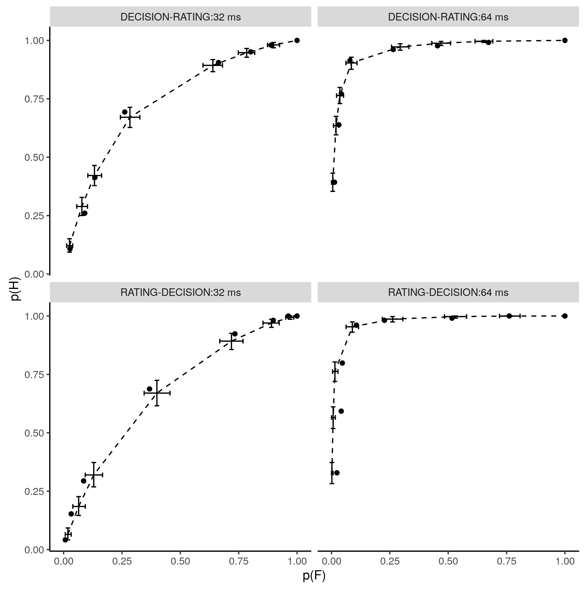
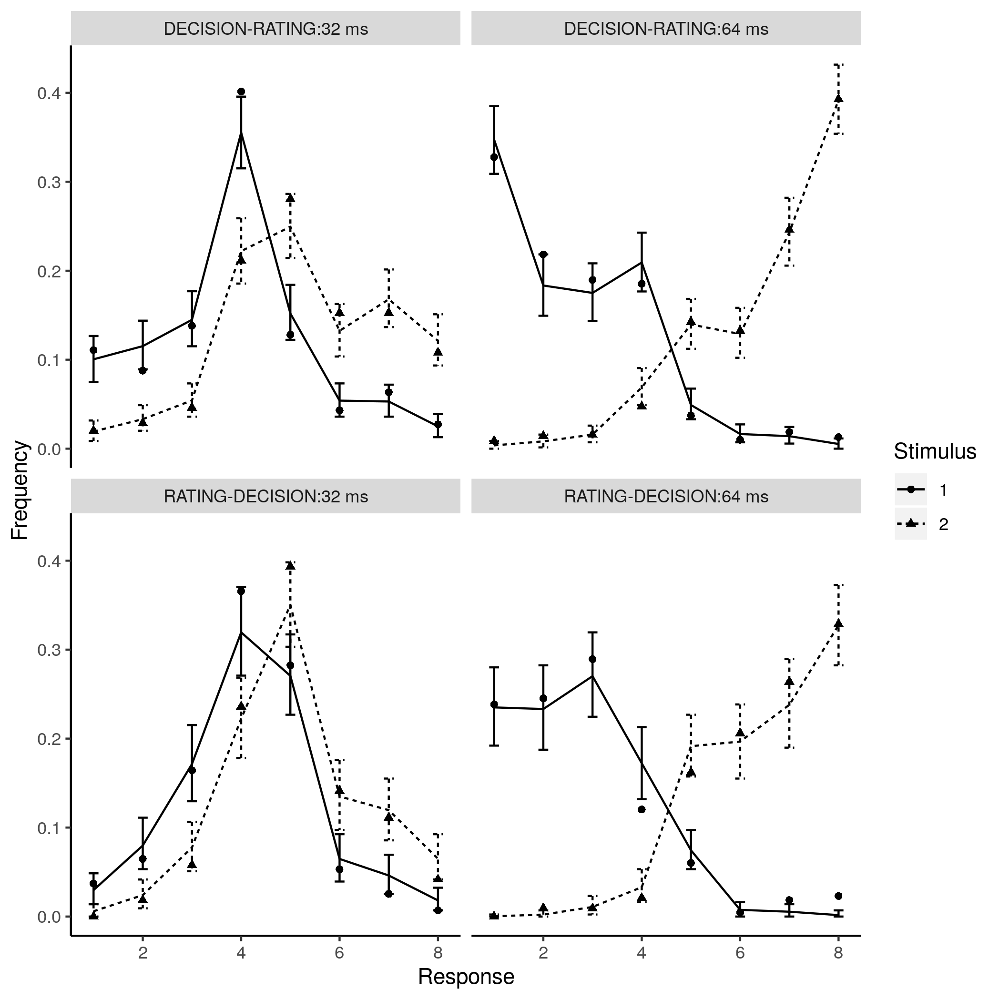

# bhsdtr

The bhsdtr (short for Bayesian Hierarchical Signal Detection Theory
with Ratings) package implements a novel method of Bayesian inference
for hierarchical or non-hierarchical equal variance normal Signal
Detection Theory models with one or more criteria. It uses the
state-of-the-art platform [Stan](http://mc-stan.org/) for sampling
from posterior distributions. Our method can accommodate binary
responses as well as additional ratings and an arbitrary number of
nested or crossed random grouping factors. SDT parameters can be
regressed on additional predictors within the same model via
intermediate unconstrained parameters, and the model can be extended
by using automatically generated human-readable Stan code as a
template.

## Background

The equal-variance SDT with one criterion is equivalent to probit
regression (see [this
paper](http://www.columbia.edu/~ld208/psymeth98.pdf) by DeCarlo) which
means that any software capable of fitting hierarchical generalized
linear models can be used to fit the hierarchical version of
equal-variance SDT *with one criterion*. However, the single-criterion
SDT model is untestable, because the data and the model have the same
dimensionality (=2). The main reason for using SDT is to deconfound
sensitivity and bias. This can only be achieved if the SDT model is
approximately true, but there is no way to test it in the
single-criterion case. The SDT model becomes testable (e.g., by
comparing the theoretical and the observed ROC curves) when it is
generalized - by introducing additional criteria - to the version that
accomodates ratings (e.g., "I am almost certain that this item is
new").

A subset of hierarchical SDT models with ratings can be fitted using
hierarchical ordered regression models, such as the cumulative model
in the excellent
[brms](https://cran.r-project.org/web/packages/brms/index.html)
package. However, without substantial modifications such models do not
restrict the d' to be non-negative, which it is by definition (as we
explain in the paper linked below). Moreover, in the cumulative model
the parameters that correspond to criteria in the SDT model cannot be
affected differently by the same grouping factor, which means that the
model assumes that the pattern of the criteria is the same for every
subject (or item, etc.). Subjects differ in their criteria placement
patterns and so the data from a typical rating experiment cannot be
independent given the SDT model with ratings represented as a
cumulative model.

Crucially, SDT is a *non-linear* model. An immediate consequence of
non-linearity is that inference based on data aggregated over random
grouping factors (such as subjects or items) is invalid, because the
resulting estimates are biased (see [this
paper](http://rouder.psyc.missouri.edu/sites/default/files/morey-jmp-zROC-2008_0.pdf)
by Morey, Pratte, and Rouder for a demonstration, or see our paper
linked below for an even more striking demonstration). The only way to
avoid this problem in the general case is to model the effects of all
the relevant random grouping factors.

In the bhsdtr package the generalized SDT model is supplemented with a
hierarchical linear regression structure (normally distributed
correlated random effects) thanks to a novel parametrization described
in [this paper](https://github.com/boryspaulewicz/bhsdtr/tree/master/inst/preprint/paper.pdf)
(which is now under review), and (more concisely) in the package
documentation. [Here](https://github.com/boryspaulewicz/bhsdtr/tree/master/inst/preprint/analysis_script.R)
is the annotated R script that performs all the analyses and produces
all the tables and some of the figures in the paper.

## Features

The bhsdtr package can be used to:

- fit generalized (more than one criterion), [meta-d'](http://www.columbia.edu/~bsm2105/type2sdt/), or basic (one criterion) equal variance SDT models
- fit hierarchical or non-hierarchical (e.g., single subject) models
- assess the fit using publication-ready ROC curve and combined response distribution plots with predictive intervals calculated for the chosen alpha level
- model the dependence of the SDT parameters on additional variables (e.g., task difficulty) using separate linear regression structures for the delta (d', meta-d') and gamma (criteria) parameters

### Prerequisites

A fairly up-to-date version of [R](https://www.r-project.org/) with
[the devtools
package](https://cran.r-project.org/web/packages/devtools/index.html)
already installed.

## Installing

The bhsdtr package, together will all of its dependencies, can be
installed directly from this github repository using the devtools
package:

```
devtools::install_git('git://github.com/boryspaulewicz/bhsdtr')
```

The installed package can be loaded using:

```
library(bhsdtr)
```

## Usage example

The package contains the gabor dataset


```
data(gabor)
head(gabor)
?gabor
```

To fit a hierarchical SDT model to this data we need to create some
data structures required by the stan function. This is how you can
create the combined response variable that encodes both the binary
classification decision and rating:

```
gabor$r = combined_response(gabor$stim, gabor$rating, gabor$acc)
```

The combined responses have to be aggregated to make the sampling more
efficient. This is done using the aggregate_resoponses function, which
requires the names of the stimulus and the combined response
variables. If the data have a hierarchical structure, this structure
has to be preserved by listing the variables that cannot be collapsed
by the aggregation step. Here we list three variables that have to be
preserved: duration, id and order.

```
adata = aggregate_responses(gabor, 'stim', 'r', c('duration', 'id', 'order'))
```

Finally, the fixed and random effects structure has to be specified
using lists of R model formulae. Here we assume that d' (= exp(delta))
depends on duration (a within-subject variable) and order (a
between-subject variable), but gamma (from which the criteria
parameter vector is derived) depends only on order. There is only one
random grouping factor - id - which represents the subjects. Note that
the random effects specification is a *list of lists* of model
formulate. That's because there can be more than one random grouping
factor.

```
fixed = list(delta = ~ -1 + duration:order, gamma = ~ -1 + order)
random = list(list(group = ~ id, delta = ~ -1 + duration, gamma = ~ 1))
```

Now we can start sampling:

```
fit = stan(model_code = make_stan_model(random),
    data = make_stan_data(adata, fixed, random),
    pars = c('delta_fixed', 'gamma_fixed',
        'delta_sd_1', 'gamma_sd_1',
        'delta_random_1', 'gamma_random_1',
        'Corr_delta_1', 'Corr_gamma_1',
        ## we need counts_new for plotting
        'counts_new'),
    iter = 8000,
    chains = 4)
```

When the make_stan_model and make_stan_data functions are called with
the optional metad=TRUE argument the meta-d' model is fitted. There
are two delta (d') parameters in the meta-d' model and so the
delta_fixed regression coefficients form a two-row matrix: the first
row represents the fixed effects for the d' parameter and the
second row represents the fixed effects for the meta-d' parameter.

The model fit can be assessed using the plot_sdt_fit function, which
produces ROC curve plots ...


```
plot_sdt_fit(fit, adata, c('order', 'duration')))
```



... or combined response distribution plots:

```
plot_sdt_fit(fit, adata, c('order', 'duration'), type = 'response')
```


