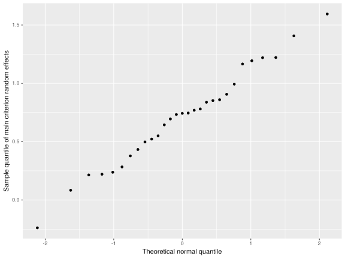

Hierarchical ordinal regression models in bhsdtr
================================================

This document contains a short tutorial on fitting hierarchical ordinal polytomous regression models using the bhsdtr package, but there is more; It also contains some explanations, illustrated with annotated code, of several issues related to ordinal models in general, and Signal Detection Theory and Item Response Theory in particular. If you are interested in any of these topics, perhaps you will find something useful here.

Anyway, it is now possible to fit hierarchical (more than two possible values) ordinal regression models in bhsdtr by using order-preserving link functions for the thresholds. If you have a bunch of Likert-type items, or confidence ratings, or PAS ratings, or anything of this sort in your data, then this model may suit your needs. To my knowledge this is a new kind of hierarchical ordinal model that can be used to estimate variability in the thresholds in a way that until recently was not possible.

Ordinal polytomous variables are common in psychology, they are usually analyzed by fitting a linear model, and all sorts of bad things happen because of this, but most people do not seem to care. I for one do not always care about this. We will not address this kind of problems here, because we will analyze ordinal data using (hierarchical) ordinal models.

We will use the following libraries and global variables:

``` r
knitr::opts_chunk$set(echo=TRUE,results="show")
library(ggplot2)
library(bhsdtr)
library(Hmisc)
library(coda)
library(rstan)
options(mc.cores = parallel::detectCores())
rstan_options(auto_write = TRUE)
## This variable indicates if the fitted models can be loaded from
## disk. I use it for caching
fresh_start = FALSE
sumfun = function(x)c(quantile(x, c(.025, .975)), mean(x))[c(1,3,2)]
```

First, we will consider an ordinal model which assumes that there is an underlying normally distributed latent variable (e.g., an evidence distribution in Signal Detection Theory, or a latent trait in an IRT model) and when the value of this variable is above the latent threshold *i*, but below the threshold *i + i*, the response *i + 1* is generated. Threshold *0* is fixed at *-infinity* and threshold *K* is fixed at *+infinity*, which means that there are *K-1* "regular" thresholds and *K* possible responses. Since once we know the total number of observations and the number of occurrences of *K - 1* different responses, the number of occurrences of the only remaining kind of response is known, there are *K - 1* degrees of freedom in such data. The response variable is ordinal, and so the thresholds are ordered. This is how this model looks like when the thresholds are equidistant and centered at the mean of the latent variable distribution (they do not have to be equidistant nor do they have to be centered):


The number of parameters in this model matches the degrees of freedom in the data (if the data are aggregated), which means that the model is saturated, which means that it always fits the data, but it does not mean that there is no uncertainty associated with the estimates of its parameters.

We will be using this dataset...

``` r
data(gabor)
```

... from which we will select two subsets of data for one condition, one subset (*d1*) with only the "noise" trials and the other (*d2*) with both the "noise" and the "signal" stimuli. We will also calculate the response variable by combining the information about the stimulus, the accuracy, and the rating.

``` r
## r = 1 ~ absolutely clear image left, r = 4 ~ no experience left, r
## = 5 ~ no experience right, ... r = 8 ~ absolutely clear image right
gabor$r = combined_response(gabor$stim, gabor$rating, gabor$acc)
d1 = gabor[(gabor$duration == '32 ms') & (gabor$order == 'DECISION-RATING') & (gabor$stim == 0),]
d2 = gabor[(gabor$duration == '32 ms') & (gabor$order == 'DECISION-RATING'),]
```

We cannot naively model the effects in the thresholds, because the thresholds have to stay ordered, and assuming, for example, that each threshold has a normal distribution due to the effect of participants would violate the ordering assumption. To supplement our model with a hierarchical linear regression structure the vector of the thresholds has to be translated to the unconstrained vector gamma. The 'log\_distance' order-preserving link function is one solution to this problem, but other order-preserving link functions are also implemented in the bhsdtr package. The choice of the link function may sometimes be important, but, since we will not introduce quantitative predictors for the thresholds, we can choose any link function which seems most convenient.

The log\_distance function is convenient for our purposes because it is simple, and because the elements of the gamma vector under this link function are easy to interpret and may be directly related to simple research questions. This link function represents the main threshold / criterion directly as a free parameter (here gamma\[4\], because K = 8, and 8 / 2 = 4); Every other criterion is represented as log of distance between the criterion and the one criterion adjacent to it which is closer to the main criterion. This way the order is preserved, and each threshold *i* is associated with the corresponding unconstrained element *i* of the gamma vector. Random and fixed effects in the thresholds are represented as (hierarchical) linear effects in gamma. The two representations are isomorphic, which means that we can always translate between the gamma and the ordered vectors if we need to.

``` r
link = 'log_distance'
```

To fit a model we have to aggregate the data as much as possible without distorting the hierarchical structure (this makes the process of sampling much faster), create the fixed- and random-effects lists, and create the data structures and the model code required by stan. Note that we introduce a new parameter - eta - which represents the average internal value. If we are going to model the effects in all the thresholds (gamma parameter vector) then this parameter is redundant, because a constant shift in the thresholds is equivalent to the opposite effect in eta. The bhsdtr package will automatically fix the first element (here the only element) of the eta fixed effects vector at 0, which will make this model identifiable.

First, we will fit the model which assumes that the pattern of the thresholds is the same for all the participants, but the mean of the latent distribution may differ across participants. If this makes little sense to you please take a look at the picture of the ordinal model with ordered thresholds and imagine that the underlying distribution has a different mean for different participants.

Note that the two assumptions, i.e., that the thresholds are constant across participants and that the latent means or samples are participant-, not item-specific seem to be often accepted in applications of Item Response Theory. This is also reflected in the IRT terminology: thresholds are often called "item-parameters" and latent means or samples are often called "person-parameters".

``` r
fixed = list(eta = ~ 1, gamma = ~ 1)
random = list(list(group = ~ id, eta = ~ 1))
adata = aggregate_responses(d1, response = 'r', variables = 'id')
model = make_stan_model(random, model = 'ordinal', gamma_link = link)
sdata = make_stan_data(adata, fixed, random, model = 'ordinal', gamma_link = link)
if(fresh_start){
    fit = stan(model_code = model, data = sdata,
                   pars = c('eta_fixed', 'gamma_fixed', 'eta_random_1', 'eta_sd_1'),
                   init_r = .5,
                   iter = 5000,
                   chains = 4)
    saveRDS(fit, '~/windows/temp/ordinal_fit.rds')
}else{
    fit = readRDS('~/windows/temp/ordinal_fit.rds')
}
print(fit, probs = c(.025, .975), pars = c('eta_fixed', 'gamma_fixed'))
```

    Inference for Stan model: 239f5edb9fbfb8db64a4ca28dc5e386a.
    4 chains, each with iter=5000; warmup=2500; thin=1; 
    post-warmup draws per chain=2500, total post-warmup draws=10000.

                      mean se_mean   sd  2.5% 97.5% n_eff Rhat
    eta_fixed[1,1]   -0.03    0.04 4.95 -9.82  9.73 16801    1
    gamma_fixed[1,1] -0.86    0.00 0.12 -1.11 -0.64 16225    1
    gamma_fixed[2,1] -0.73    0.00 0.10 -0.92 -0.55 17312    1
    gamma_fixed[3,1]  0.15    0.00 0.05  0.04  0.25 15983    1
    gamma_fixed[4,1]  0.71    0.00 0.10  0.52  0.92  4331    1
    gamma_fixed[5,1] -0.70    0.00 0.10 -0.91 -0.51 17648    1
    gamma_fixed[6,1] -1.47    0.00 0.17 -1.83 -1.15 15419    1
    gamma_fixed[7,1] -0.55    0.00 0.15 -0.85 -0.27 17252    1

    Samples were drawn using NUTS(diag_e) at Sun Feb 16 11:38:13 2020.
    For each parameter, n_eff is a crude measure of effective sample size,
    and Rhat is the potential scale reduction factor on split chains (at 
    convergence, Rhat=1).

Here is how the model fits (this is a maximum likelihood fit):

``` r
## This function is not defined in the bhsdtr package
sdt_ml_plot(model, adata, sdata)
```


So how do the "item-parameters" look like according to this model?

``` r
crit = gamma_to_crit(as.data.frame(fit))
round(t(apply(crit, 2, sumfun)), 2)
```

                         2.5%       97.5%
    criteria_fixed[1,1] -3.26 -3.02 -2.78
    criteria_fixed[2,1] -2.33 -2.15 -1.97
    criteria_fixed[3,1] -1.06 -0.92 -0.79
    criteria_fixed[4,1]  0.53  0.72  0.92
    criteria_fixed[5,1]  0.97  1.15  1.33
    criteria_fixed[6,1]  1.19  1.37  1.55
    criteria_fixed[7,1]  1.93  2.03  2.13

Note that the main criterion (gamma\[4,1\]) is *positive*, which makes sense, since when the stimulus is of class "noise" the middle criterion / threshold / average position of the thresholds is *to the right* of the evidence distribution mean. Otherwise, as we will see later, in this particular case, and perhaps also in many other similar cases, these thresholds-as-"item-parameters" are probably meaningless.

Now we will introduce the model which accounts for the inter-individual differences in the pattern of the thresholds by modelling the gamma random effects.

``` r
adata0 = aggregate_responses(d1, response = 'r', variables = c('id'))
## The only element of the eta fixed effects vector will be automatically fixed at 0
fixed0 = list(eta = ~ 1, gamma = ~ 1)
## Each participant has a unique patterh of the thresholds / gamma
random0 = list(list(group = ~ id, gamma = ~ 1))
model0 = make_stan_model(random0, model = 'ordinal', gamma_link = link)
sdata0 = make_stan_data(adata0, fixed0, random0, model = 'ordinal', gamma_link = link)
if(fresh_start){
    fit0 = stan(model_code = model0, data = sdata0,
                pars = c('gamma_fixed', 'gamma_random_1', 'gamma_sd_1'),
                init_r = .5,
                iter = 5000,
                chains = 4)
    saveRDS(fit0, '~/windows/temp/ordinal_fit_0.rds')
}else{
    fit0 = readRDS('~/windows/temp/ordinal_fit_0.rds')
}
```

``` r
print(fit0, probs = c(.025, .975), pars = c('gamma_fixed', 'gamma_sd_1'))
```

    Inference for Stan model: 5e8ce6f1ba0470737c114b566c5ef550.
    4 chains, each with iter=5000; warmup=2500; thin=1; 
    post-warmup draws per chain=2500, total post-warmup draws=10000.

                      mean se_mean   sd  2.5% 97.5% n_eff Rhat
    gamma_fixed[1,1] -1.17    0.01 0.43 -2.07 -0.36  2174    1
    gamma_fixed[2,1] -0.51    0.00 0.18 -0.86 -0.14  4190    1
    gamma_fixed[3,1]  0.06    0.00 0.14 -0.23  0.32  4201    1
    gamma_fixed[4,1]  0.73    0.00 0.13  0.49  0.99  5256    1
    gamma_fixed[5,1] -0.77    0.00 0.23 -1.25 -0.34  5515    1
    gamma_fixed[6,1] -1.33    0.00 0.31 -1.95 -0.72  6705    1
    gamma_fixed[7,1] -0.27    0.00 0.29 -0.74  0.43  3507    1
    gamma_sd_1[1,1]   1.29    0.01 0.49  0.59  2.50  3134    1
    gamma_sd_1[2,1]   0.69    0.00 0.20  0.36  1.13  5397    1
    gamma_sd_1[3,1]   0.66    0.00 0.12  0.47  0.93  5745    1
    gamma_sd_1[4,1]   0.60    0.00 0.12  0.40  0.86  4274    1
    gamma_sd_1[5,1]   0.89    0.00 0.24  0.50  1.45  5498    1
    gamma_sd_1[6,1]   0.82    0.01 0.36  0.21  1.66  4885    1
    gamma_sd_1[7,1]   0.44    0.01 0.35  0.02  1.35  3022    1

    Samples were drawn using NUTS(diag_e) at Sun Feb 16 11:39:55 2020.
    For each parameter, n_eff is a crude measure of effective sample size,
    and Rhat is the potential scale reduction factor on split chains (at 
    convergence, Rhat=1).

Below we translate between the gamma and the criteria vectors (fixed effects):

``` r
s0 = as.data.frame(fit0)
crit0 = gamma_to_crit(s0, gamma_link = link)
```

Are the average thesholds different in the two models? Off course they are, since the models are non-linear and averaging over anything that affects any parameter of such models is a bad idea:

``` r
crit_sm = as.data.frame(t(apply(crit, 2, sumfun)))
crit0_sm = as.data.frame(t(apply(crit0, 2, sumfun)))
crit_sm$model = 'fixed thresholds'
crit0_sm$model = "random thresholds"
crit_sm$threshold = 1:7 - .1
crit0_sm$threshold = 1:7 + .1
df = rbind(crit_sm, crit0_sm)
names(df)[1:3] = c('lo', 'mean', 'hi')
ggplot(df, aes(threshold, mean, group = model, color = model)) + geom_point() + geom_line() + geom_errorbar(aes(ymin = lo, ymax = hi))
```


The point and interval estimates of the thresholds based on the thresholds-as-"item-parameters" model are severely biased. In particular, the uncertainty in the estimates is severely underestimated in this model. Was it obvious to you that the model with no threshold random effects is such a bad idea?

Now we will fit a model which is similar to an SDT model, but there will be two important differences. We will not assume that the answer "signal" cannot be less likely for the stimulus "signal" than for the stimulus "noise", i.e., we will not assume that *d'* must be non-negative, and we will *not* assume that the pattern of the thresholds is the same for the "noise" and the "signal" stimuli. If you know your Signal Detection Theory well, this may seem to you like a perverse idea. If that is the case, please bear with me.

In this model each participant may have two different sets of thresholds, one for the "noise" and one for the "signal" stimuli. We will account for the fact that participant specific threshold effects may be correlated; They are usually correlated, because if some threshold is higher (lower) than the sample average, then the threshold above (below) it may also be higher (lower).

Here we introduce the effect of the stimulus on the gamma / thresholds vector. We use separate intercepts and slopes parametrization (-1 + stim), i.e., the thresholds are to be estimated for each stimulus class instead of estimating them for "noise" stimuli and estimating the difference in the thresholds between "signal" and "noise".

``` r
fixed1 = list(eta = ~ 1, gamma = ~ -1 + stim)
random1 = list(list(group = ~ id, gamma = ~ -1 + stim))
## We have to make sure that stim is a factor for the separate
## intercepts and slopes parametrization to work as intended.
d2$stim = as.factor(d2$stim)
## Note that because for an ordinal model the stimulus variable (here
## the 'stim' variable) is not special, we have to include it in the
## additional variables vector
adata1 = aggregate_responses(d2, response = 'r', variables = c('id', 'stim'))
sdata1 = make_stan_data(adata1, fixed1, random1, model = 'ordinal', gamma_link = link)
model1 = make_stan_model(random1, model = 'ordinal', gamma_link = link)
if(fresh_start){
    fit1 = stan(model_code = model1, data = sdata1,
                pars = c('gamma_fixed', 'gamma_random_1', 'gamma_sd_1'),
                init_r = .5,
                iter = 5000,
                chains = 4)
    saveRDS(fit1, '~/windows/temp/ordinal_fit_1.rds')
}else{
    fit1 = readRDS('~/windows/temp/ordinal_fit_1.rds')
}
## We will not look at the eta parameter since it was fixed at 0
print(fit1, probs = c(.025, .975), pars = c('gamma_fixed', 'gamma_sd_1'))
```

    Inference for Stan model: 5e8ce6f1ba0470737c114b566c5ef550.
    4 chains, each with iter=5000; warmup=2500; thin=1; 
    post-warmup draws per chain=2500, total post-warmup draws=10000.

                      mean se_mean   sd  2.5% 97.5% n_eff Rhat
    gamma_fixed[1,1] -1.12    0.01 0.41 -1.97 -0.37  4109    1
    gamma_fixed[1,2] -0.69    0.01 0.46 -1.50  0.38  6862    1
    gamma_fixed[2,1] -0.52    0.00 0.18 -0.86 -0.16  6558    1
    gamma_fixed[2,2] -1.13    0.00 0.37 -1.94 -0.48  8568    1
    gamma_fixed[3,1]  0.06    0.00 0.13 -0.21  0.32  6326    1
    gamma_fixed[3,2] -0.04    0.00 0.15 -0.33  0.27  9222    1
    gamma_fixed[4,1]  0.72    0.00 0.13  0.49  0.98  7185    1
    gamma_fixed[4,2] -0.59    0.00 0.13 -0.84 -0.34  9878    1
    gamma_fixed[5,1] -0.75    0.00 0.23 -1.21 -0.32  9299    1
    gamma_fixed[5,2] -0.38    0.00 0.15 -0.68 -0.10  8172    1
    gamma_fixed[6,1] -1.35    0.00 0.28 -1.92 -0.79 11621    1
    gamma_fixed[6,2] -0.81    0.00 0.17 -1.16 -0.50 10492    1
    gamma_fixed[7,1] -0.24    0.00 0.29 -0.70  0.43  7222    1
    gamma_fixed[7,2] -0.40    0.00 0.12 -0.65 -0.17 11742    1
    gamma_sd_1[1,1]   1.29    0.01 0.50  0.60  2.51  4359    1
    gamma_sd_1[1,2]   0.84    0.01 0.63  0.04  2.41  4994    1
    gamma_sd_1[2,1]   0.68    0.00 0.19  0.36  1.10  7225    1
    gamma_sd_1[2,2]   0.91    0.01 0.44  0.20  1.92  5314    1
    gamma_sd_1[3,1]   0.63    0.00 0.11  0.45  0.86  8046    1
    gamma_sd_1[3,2]   0.55    0.00 0.15  0.30  0.88  8664    1
    gamma_sd_1[4,1]   0.59    0.00 0.11  0.40  0.83  5553    1
    gamma_sd_1[4,2]   0.61    0.00 0.10  0.43  0.84  8412    1
    gamma_sd_1[5,1]   0.89    0.00 0.24  0.51  1.44  7036    1
    gamma_sd_1[5,2]   0.65    0.00 0.11  0.46  0.90  8999    1
    gamma_sd_1[6,1]   0.75    0.00 0.33  0.16  1.50  5262    1
    gamma_sd_1[6,2]   0.63    0.00 0.18  0.32  1.05  7038    1
    gamma_sd_1[7,1]   0.47    0.01 0.34  0.03  1.29  4386    1
    gamma_sd_1[7,2]   0.30    0.00 0.19  0.01  0.72  3870    1

    Samples were drawn using NUTS(diag_e) at Sun Feb 16 11:41:59 2020.
    For each parameter, n_eff is a crude measure of effective sample size,
    and Rhat is the potential scale reduction factor on split chains (at 
    convergence, Rhat=1).

Now we can again translate between the gamma and the criteria vectors (fixed effects) for each stimulus:

``` r
s1 = as.data.frame(fit1)
crit1 = gamma_to_crit(s1, 1, gamma_link = link)
crit2 = gamma_to_crit(s1, 1, beta_index = 2, gamma_link = link)
sumfun = function(x)c(quantile(x, c(.025, .975)), mean(x))[c(1,3,2)]
crit1_sm = apply(crit1, 2, sumfun)
crit2_sm = apply(crit2, 2, sumfun)
```

The criteria for the stimulus class "noise" look like this:

``` r
round(t(crit1_sm), 2)
```

          2.5%       97.5%
    [1,] -1.82 -1.30 -0.89
    [2,] -1.37 -0.95 -0.59
    [3,] -0.66 -0.34 -0.06
    [4,]  0.49  0.72  0.98
    [5,]  0.92  1.21  1.55
    [6,]  1.17  1.48  1.87
    [7,]  1.83  2.31  3.10

and the criteria for the stimulus class "signal" look like this:

``` r
round(t(crit2_sm), 2)
```

          2.5%       97.5%
    [1,] -3.49 -2.48 -1.92
    [2,] -2.38 -1.91 -1.52
    [3,] -1.96 -1.56 -1.22
    [4,] -0.84 -0.59 -0.34
    [5,] -0.15  0.10  0.37
    [6,]  0.29  0.56  0.84
    [7,]  0.94  1.23  1.55

Note the difference between the main criterion (row 4). This difference approximates *d'*. Even though, as we will later see, this model does not correctly account for the effect of the stimulus (because it violates the non-negativity assumption), we can still recover this effect pretty well, because *d'* is equivalent to a constant shift of all the thresholds in one predefined direction. Shifting all the criteria to the right is equivalent to shifting the underlying distribution of latent values (or evidence) to the left, so we have to subtract the average position of the criteria for the "signal" stimuli from the average position of the criteria for the "noise" stimuli. Here is our first attempt:

``` r
dprim1 = sumfun(s1[, 'gamma_fixed[4,1]'] - s1[, 'gamma_fixed[4,2]'])
round(dprim1, 2)
```

     2.5%       97.5% 
     0.95  1.31  1.68 

We will later see that this is our average *d'*, but it also isn't.

In an SDT model we usually assume that the stimulus class affects *only* the *d'* parameter, and that both criteria (gamma) and *d'* may differ between the participants (or items, etc.). In bhsdtr *d'* is represented as *log(d') = delta*, which forces it to be non-negative. This is an important assumption of Signal Detection Theory - if this assumption is violated, for example, because of the response reversal in some participants or conditions, then an SDT model is not valid and a non-trivial generalization of SDT should be used instead (see the bhsdtr [preprint](http://dx.doi.org/10.23668/psycharchives.2725) for a more detailed explanation and some references).

``` r
## We want one average d' / delta and one vector of average
## thresholds / criteria / gammma
fixed2 = list(delta = ~ 1, gamma = ~ 1)
## Each participant has a unique d' / delta and a unique set of
## thresholds / criteria / gamma
random2 = list(list(group = ~ id, delta = ~ 1, gamma = ~ 1))
```

Because of the importance of the stimulus class in SDT models ("noise", or 1, and "signal", or 2) we have to indicate which variable represents this information ( aggregate\_responses(..., stimulus = 'stim', ...) ) when calling the aggregate\_responses function.

``` r
adata2 = aggregate_responses(d2, stimulus = 'stim', response = 'r', variables = c('id'))
sdata2 = make_stan_data(adata2, fixed2, random2, model = 'sdt', gamma_link = link)
model2 = make_stan_model(random2, model = 'sdt', gamma_link = link)
if(fresh_start){
    fit2 = stan(model_code = model2, data = sdata2,
                pars = c('delta_fixed', 'gamma_fixed', 'delta_sd_1', 'gamma_sd_1',
                         'delta_random_1', 'gamma_random_1',
                         ## We will need this for the plot_sdt_fit function
                         'counts_new'),
                init_r = .5,
                iter = 5000,
                chains = 4)
    saveRDS(fit2, '~/windows/temp/ordinal_fit_2.rds')
}else{
    fit2 = readRDS('~/windows/temp/ordinal_fit_2.rds')
}
print(fit2, probs = c(.025, .975), pars = c('delta_fixed', 'gamma_fixed', 'delta_sd_1', 'gamma_sd_1'))
```

    Inference for Stan model: 4a70e45aa409298a13fc1510afb83180.
    4 chains, each with iter=5000; warmup=2500; thin=1; 
    post-warmup draws per chain=2500, total post-warmup draws=10000.

                      mean se_mean   sd  2.5% 97.5% n_eff Rhat
    delta_fixed[1,1] -0.09    0.00 0.17 -0.45  0.23  3503    1
    gamma_fixed[1,1] -1.00    0.01 0.30 -1.64 -0.46  2831    1
    gamma_fixed[2,1] -0.64    0.00 0.15 -0.94 -0.34  4170    1
    gamma_fixed[3,1]  0.03    0.00 0.13 -0.23  0.28  3502    1
    gamma_fixed[4,1]  0.08    0.00 0.08 -0.07  0.24  5562    1
    gamma_fixed[5,1] -0.51    0.00 0.15 -0.81 -0.21  4320    1
    gamma_fixed[6,1] -0.90    0.00 0.14 -1.19 -0.65  5287    1
    gamma_fixed[7,1] -0.38    0.00 0.12 -0.61 -0.15  7890    1
    delta_sd_1[1,1]   0.78    0.00 0.16  0.52  1.15  3969    1
    gamma_sd_1[1,1]   0.99    0.01 0.32  0.49  1.75  3479    1
    gamma_sd_1[2,1]   0.56    0.00 0.15  0.30  0.89  5342    1
    gamma_sd_1[3,1]   0.63    0.00 0.10  0.46  0.86  5407    1
    gamma_sd_1[4,1]   0.37    0.00 0.07  0.25  0.52  4279    1
    gamma_sd_1[5,1]   0.75    0.00 0.13  0.54  1.03  5587    1
    gamma_sd_1[6,1]   0.55    0.00 0.14  0.31  0.86  5205    1
    gamma_sd_1[7,1]   0.33    0.00 0.17  0.03  0.68  2897    1

    Samples were drawn using NUTS(diag_e) at Sun Feb 16 11:44:45 2020.
    For each parameter, n_eff is a crude measure of effective sample size,
    and Rhat is the potential scale reduction factor on split chains (at 
    convergence, Rhat=1).

So how well do the two *d'* estimates match? We can translate between the delta and the *d'* parameters by using exponentiation. We have to do this first, before doing anything else with the posterior samples, because the exponential function is non-linear.

``` r
s2 = as.data.frame(fit2)
dprim2 = sumfun(exp(s2[,'delta_fixed[1,1]']))
round(cbind(dprim1, dprim2), 2)
```

          dprim1 dprim2
    2.5%    0.95   0.64
            1.31   0.92
    97.5%   1.68   1.25

The estimates match poorly. Or do they? What about the individual *d'* estimates? To calculate the individual shifts in the thresholds / criteria in the more general ordinal model we have to add the random effects of participants to the fixed effect:

``` r
dprim1i = (s1[['gamma_fixed[4,1]']] + s1[, grep('gamma_random_1\\[.+,4,1]', names(s1))]) -
    (s1[['gamma_fixed[4,2]']] + s1[, grep('gamma_random_1\\[.+,4,2]', names(s1))])
dprim1i = as.data.frame(t(apply(dprim1i, 2, sumfun)))
dprim2i = as.data.frame(t(apply(exp(s2[['delta_fixed[1,1]']] +
                                    s2[, grep('delta_random_1', names(s2))]), 2, sumfun)))
names(dprim1i) = names(dprim2i) = c('lo', 'mean', 'hi')
dprim1i$model = 'ordinal'
dprim1i$i = 1:nrow(dprim1i) - .1
dprim2i$model = 'sdt'
dprim2i$i = 1:nrow(dprim2i) + .1
ggplot(rbind(dprim1i, dprim2i), aes(i, mean, group = model, color = model)) +
    geom_point() + geom_errorbar(aes(ymin = lo, ymax = hi)) +
    geom_abline(intercept = 0, slope = 0) +
    ylab('d\'') +
    labs(title = sprintf('Correlation between individual d\' estimates: r = %.2f',
                         cor(dprim1i$mean, dprim2i$mean)))
```


The point and interval estimates match quite well (*r* = .93 for the point estimates), with some notable exceptions. According to the ordinal model some credible intervals around individual *d'* point estimates include 0 and one point estimate is even below 0, which contradicts an important assumption of the SDT model. We will address this issue later.

If the participant-specific *d'* estimates match, the average *d'* should also match, right? Maybe the SDT model does not fit the data well?

``` r
plot_sdt_fit(fit2, adata2, c('id'), type = 'response', bw = F, verbose = F)
```


The SDT model seems to fit very well in a sense that the observed distributions of responses are well within the 95% posterior predictive intervals for each participant. However, this does not mean much; An SDT model with multiple criteria is not saturated, so it does not have to fit the data, but it does not leave too many degrees of freedom in the data either. We can safely assume a priori that it will usually fit the data well, regardless if it is true or not.

The discrepancy between the average *d'* estimates from both models is not really a consequence of allowing for negative *d'* values in the ordinal model. This discrepancy is a consequence of the assumed distribution of individual shifts / *d'* values. In the ordinal model we assumed that the shifts (*= d'*) are normally distributed, whereas in the SDT model we assumed that *log(d')* are normally distributed. We can see if the assumption that *log(d')* (or *d'*) are normally distributed is approximately correct in our dataset. First, let's take a look at the participant-specific delta estimates in the SDT model:

``` r
## Participant's delta = average delta + participant's effect
delta2 = apply(s2[['delta_fixed[1,1]']] + s2[, grep('delta_random_1', names(s2))], 2, mean)
ggplot(data.frame(delta = delta2), aes(sample = delta)) +
    stat_qq() +
    ylab('Sample quantile of log(d\') = delta random effects') +
    xlab('Theoretical normal quantile') +
    labs(title = 'SDT model')
```


The individual *delta = log(d')* estimates in the SDT model seem to be approximately normally distributed. We cannot plot *log(d')* estimates based on the ordinal model, because according to this model one participant has a negative *d'* value and even without this participant's data there are quite a few negative posterior *d'* samples. However, we can see if the *d'* point estimates based on the general ordinal model are approximately normally distributed:

``` r
ggplot(data.frame(dprim = dprim1i$mean), aes(sample = dprim)) +
    stat_qq() +
    ylab('Sample quantile of d\' random effects') +
    xlab('Theoretical normal quantile') +
    labs('Ordinal model')
```


They seem to be approximately normally distributed as well. The average *d'* in each model is estimated as a mean of different distributions: in the ordinal model participant-specific shifts are assumed to be normally distributed, but in the SDT model *delta = log(d')* random effects are assumed to be normally distributed. We can easily account for this by making use of the relationship between the parameters of the normal distribution and the associated log-normal distribution:

``` r
round(cbind(sumfun(exp(s2[['delta_sd_1[1,1]']]^2 / 2 + s2[['delta_fixed[1,1]']])),
            dprim1), 2)
```

               dprim1
    2.5%  0.90   0.95
          1.27   1.31
    97.5% 1.89   1.68

Now we see that the two models give very similar point and interval estimates of average *d'*. How cool is this?

To summarize, the SDT model is much simpler (it has only one set of thresholds for each participant), it fits the data well at the individual level, and it correctly assumes that the individual *d'* / shift values are log-normally distributed. SDT is a clear winner, right? Not yet it isn't.

Causal assumptions of Signal Detection Theory
=============================================

An SDT model is not only a statistical model, it also has *causal* assumptions. To be clear, an SDT model *as a statistical model* does not have any causal assumptions. However, causal assumptions are present when the parameters of this model are interpreted as properties of a psychological process, or when it is used to *deconfound* (a causal notion) sensitivity (another extra-statistical notion) from bias (this term has a technical meaning in statistics, but it means something *psychological* in an SDT model - *a tendency to prefer one class of stimuli over the other*).

Because the gabor dataset comes from a study in which the stimulus class was chosen at random on every trial, every estimate of the statistical effect of the stimulus class on any parameter of the model is an unbiased estimate of the total causal effect of the stimulus class on this parameter. Moreover, in such designs every statistical effect of the participant factor is an estimate of the property or the causal effect of the participants. This means that both the individual *d'* parameters and the individual thresholds are participant-, not item-, parameters in this model. So far so good.

However, in the SDT model we also assumed that the stimulus class can *only* affect the distance between the evidence distribution means (= *d'*), whereas in the ordinal model we allowed for the possibility of the stimulus class having an effect on the pattern of the thresholds. It may seem odd to you to allow for this, but there is nothing in the design of the study that justifies the causal assumption of selective influence. The estimates of the thresholds are based on the data that were generated after the stimulus was presented, and so, theoretically, the pattern of the thresholds could be affected by the stimulus class as well.

It does not matter if an SDT model with selectivity assumption fits the data well, because if the effect of the stimulus class is not selective, the model is simply false. In particular, when the selectivity assumption is false, an SDT model cannot deconfound sensitivity / *d'* from bias / threshold / criteria effects. Once we drop the selectivity assumption there is no longer any *d'* / internal value parameter, only the thresholds, like in our general ordinal model. The selectivity assumption is central to Signal Detection Theory. If you know your Signal Detection Theory well, please take a moment and try to recall one instant of this important assumption being explicitly addressed in a paper or a book on Signal Detection Theory. If you manage to find one such example, please send me an email.

Before we go any further, just for fun, let's see what happens if we introduce yet another assumption of selective influence. We will fit a hierarchical SDT model in which we will treat the thresholds as "item-parameters" and we will treat the *d'* parameter as a "person-parameter".

``` r
fixed3 = list(delta = ~ 1, gamma = ~ 1)
## Each participant has a unique d', but not thresholds
random3 = list(list(group = ~ id, delta = ~ 1))
adata3 = aggregate_responses(d2, stimulus = 'stim', response = 'r', variables = c('id'))
sdata3 = make_stan_data(adata3, fixed3, random3, model = 'sdt', gamma_link = link)
model3 = make_stan_model(random3, model = 'sdt', gamma_link = link)
if(fresh_start){
    fit3 = stan(model_code = model3, data = sdata3,
                pars = c('delta_fixed', 'delta_sd_1', 'gamma_fixed', 'delta_random_1',
                         ## We will need this for the plot_sdt_fit function
                         'counts_new'),
                init_r = .5,
                iter = 5000,
                chains = 4)
    saveRDS(fit3, '~/windows/temp/ordinal_fit_3.rds')
}else{
    fit3 = readRDS('~/windows/temp/ordinal_fit_3.rds')
}
print(fit3, probs = c(.025, .975), pars = c('delta_fixed', 'gamma_fixed', 'delta_sd_1'))
```

    Inference for Stan model: b72e870c1fc3b31bf1b92fbb4f9d2e71.
    4 chains, each with iter=5000; warmup=2500; thin=1; 
    post-warmup draws per chain=2500, total post-warmup draws=10000.

                      mean se_mean   sd  2.5% 97.5% n_eff Rhat
    delta_fixed[1,1] -0.32       0 0.20 -0.75  0.04  2899    1
    gamma_fixed[1,1] -0.88       0 0.11 -1.10 -0.68 17050    1
    gamma_fixed[2,1] -0.83       0 0.08 -0.99 -0.67 17053    1
    gamma_fixed[3,1]  0.00       0 0.04 -0.08  0.09 13641    1
    gamma_fixed[4,1]  0.07       0 0.04  0.00  0.14 11457    1
    gamma_fixed[5,1] -0.44       0 0.05 -0.54 -0.33 12723    1
    gamma_fixed[6,1] -0.97       0 0.08 -1.13 -0.81 15033    1
    gamma_fixed[7,1] -0.45       0 0.08 -0.61 -0.30 15277    1
    delta_sd_1[1,1]   0.86       0 0.18  0.58  1.29  2843    1

    Samples were drawn using NUTS(diag_e) at Sun Feb 16 11:47:01 2020.
    For each parameter, n_eff is a crude measure of effective sample size,
    and Rhat is the potential scale reduction factor on split chains (at 
    convergence, Rhat=1).

Does the model fit?

``` r
plot_sdt_fit(fit3, adata3, type = 'response', bw = F, verbose = F)
```


At the aggregated data level the fit is not perfect, but maybe it is not that terrible either. What about the fit at the individual level?

``` r
plot_sdt_fit(fit3, adata3, 'id', type = 'response', bw = F, verbose = F)
```


A few points are outside the predictive intervals, but maybe that's ok? What if we compared the point and interval estimates of the so-called "person-parameters"?

``` r
s3 = as.data.frame(fit3)
dprim3i = as.data.frame(t(apply(exp(s3[['delta_fixed[1,1]']] + s3[, grep('delta_random_1', names(s3))]), 2, sumfun)))
names(dprim3i) = c('lo', 'mean', 'hi')
dprim3i$model = 'person- and item-parameters'
dprim3i$i = 1:nrow(dprim3i) - .1
ggplot(rbind(dprim2i, dprim3i), aes(i, mean, group = model, color = model)) +
    geom_point() + geom_errorbar(aes(ymin = lo, ymax = hi)) +
    geom_abline(intercept = 0, slope = 0) +
    labs(title = sprintf('Correlation between individual d\' estimates: r = %.2f', cor(dprim2i$mean, dprim3i$mean)))    
```


This does not look good at all. In particular, some of the point and interval estimates are clearly biased. If we compare the average width of the intervals...

``` r
round(mean(dprim3i$hi - dprim3i$lo) / mean(dprim2i$hi - dprim2i$lo), 2)
```

    [1] 0.81

... we see that the simplified model not only gives biased "person-parameter" estimates but the estimates seem more reliable (they are shorter by about 20% on average). It does not make sense to look at the estimates of the "item-parameters" since we already know that they have little in common with the true thresholds.

Now back to Signal Detection Theory and the assumption of selective influence. We can at least try to test this assumption. We will not alter the ordinal model code to account for the non-negativity of *d'* (and the log-normal distribution of random *d'* effects) just yet. As we already know, even without this correction the estimates of participants' shifts are similar to the *d'* estimates.

Note that we do not use the separate intercepts and slopes parametrization here (we use ~ stim instead of ~ -1 + stim), because we are very much interested in the difference in the pattern of the thresholds caused by the stimulus class.

``` r
## Separate thresholds for "signa" and "noise"
fixed4 = list(eta = ~ 1, gamma = ~ stim)
## Each participants has two unique sets of thresholds, one for "signa" and one for "noise".
random4 = list(list(group = ~ id, gamma = ~ stim))
adata4 = aggregate_responses(d2, response = 'r', variables = c('id', 'stim'))
sdata4 = make_stan_data(adata4, fixed4, random4, model = 'ordinal', gamma_link = link)
model4 = make_stan_model(random4, model = 'ordinal', gamma_link = link)
if(fresh_start){
    fit4 = stan(model_code = model4, data = sdata4,
                pars = c('gamma_fixed', 'gamma_random_1', 'gamma_sd_1'),
                init_r = .5,
                iter = 5000,
                chains = 4)
    saveRDS(fit4, '~/windows/temp/ordinal_fit_4.rds')
}else{
    fit4 = readRDS('~/windows/temp/ordinal_fit_4.rds')
}
print(fit4, probs = c(.025, .975), pars = c('gamma_fixed', 'gamma_sd_1'))
```

    Inference for Stan model: 5e8ce6f1ba0470737c114b566c5ef550.
    4 chains, each with iter=5000; warmup=2500; thin=1; 
    post-warmup draws per chain=2500, total post-warmup draws=10000.

                      mean se_mean   sd  2.5% 97.5% n_eff Rhat
    gamma_fixed[1,1] -1.09    0.01 0.34 -1.84 -0.47  3088    1
    gamma_fixed[1,2]  0.41    0.01 0.60 -0.66  1.72  4963    1
    gamma_fixed[2,1] -0.56    0.00 0.17 -0.89 -0.23  4314    1
    gamma_fixed[2,2] -0.55    0.01 0.41 -1.44  0.16  5727    1
    gamma_fixed[3,1]  0.06    0.00 0.13 -0.20  0.32  4210    1
    gamma_fixed[3,2] -0.12    0.00 0.13 -0.37  0.13  8933    1
    gamma_fixed[4,1]  0.71    0.00 0.11  0.49  0.92  4076    1
    gamma_fixed[4,2] -1.29    0.00 0.16 -1.61 -0.97  5413    1
    gamma_fixed[5,1] -0.73    0.00 0.18 -1.08 -0.38  5661    1
    gamma_fixed[5,2]  0.33    0.00 0.14  0.05  0.60 10035    1
    gamma_fixed[6,1] -1.34    0.00 0.21 -1.78 -0.93  7268    1
    gamma_fixed[6,2]  0.51    0.00 0.25  0.03  1.00  7149    1
    gamma_fixed[7,1] -0.40    0.00 0.18 -0.76 -0.05  8098    1
    gamma_fixed[7,2]  0.01    0.00 0.21 -0.40  0.41  8109    1
    gamma_sd_1[1,1]   1.10    0.01 0.39  0.52  2.02  3405    1
    gamma_sd_1[1,2]   1.20    0.01 0.74  0.11  2.91  4046    1
    gamma_sd_1[2,1]   0.63    0.00 0.18  0.31  1.01  4770    1
    gamma_sd_1[2,2]   0.94    0.01 0.48  0.14  2.06  3473    1
    gamma_sd_1[3,1]   0.63    0.00 0.10  0.45  0.86  5969    1
    gamma_sd_1[3,2]   0.24    0.00 0.16  0.01  0.59  4125    1
    gamma_sd_1[4,1]   0.49    0.00 0.09  0.34  0.68  4036    1
    gamma_sd_1[4,2]   0.76    0.00 0.13  0.54  1.05  4626    1
    gamma_sd_1[5,1]   0.73    0.00 0.13  0.50  1.02  6555    1
    gamma_sd_1[5,2]   0.23    0.00 0.16  0.01  0.58  2955    1
    gamma_sd_1[6,1]   0.45    0.00 0.20  0.05  0.84  3183    1
    gamma_sd_1[6,2]   0.53    0.01 0.25  0.06  1.07  2528    1
    gamma_sd_1[7,1]   0.29    0.00 0.18  0.02  0.67  3343    1
    gamma_sd_1[7,2]   0.29    0.00 0.20  0.01  0.74  3051    1

    Samples were drawn using NUTS(diag_e) at Sun Feb 16 11:50:13 2020.
    For each parameter, n_eff is a crude measure of effective sample size,
    and Rhat is the potential scale reduction factor on split chains (at 
    convergence, Rhat=1).

Here we see the estimated average shift / *d'* thought of as the mean of the normally distributed *d'* (not *delta = log(d')*) random effects again:

``` r
s4 = as.data.frame(fit4)
round(cbind(sumfun(-s4[['gamma_fixed[4,2]']]), dprim1), 2)
```

               dprim1
    2.5%  0.97   0.95
          1.29   1.31
    97.5% 1.61   1.68

Ok, we did simplify things a bit, but it still makes sense to take a look at the other gamma effects, because these other effects correspond to the variability in the *pattern* of the thresholds, and the estimates of the thresholds in our ordinal model seem perfectly fine.

``` r
round(HPDinterval(as.mcmc(s4[, grep('gamma_fixed', names(s4))])), 2)
```

                     lower upper
    gamma_fixed[1,1] -1.79 -0.44
    gamma_fixed[2,1] -0.89 -0.23
    gamma_fixed[3,1] -0.21  0.30
    gamma_fixed[4,1]  0.49  0.92
    gamma_fixed[5,1] -1.09 -0.39
    gamma_fixed[6,1] -1.76 -0.92
    gamma_fixed[7,1] -0.77 -0.06
    gamma_fixed[1,2] -0.69  1.69
    gamma_fixed[2,2] -1.37  0.21
    gamma_fixed[3,2] -0.36  0.13
    gamma_fixed[4,2] -1.60 -0.95
    gamma_fixed[5,2]  0.05  0.60
    gamma_fixed[6,2]  0.02  0.99
    gamma_fixed[7,2] -0.39  0.42
    attr(,"Probability")
    [1] 0.95

Among the parameters that represent the stimulus-induced average differences between the gamma parameters (i.e., gamma\_fixed\[.,2\]) the gamma\_fixed\[4,2\] parameter does not seem to be the only one that is non-zero. This indicates that the pattern of the thresholds - not only their average position (= gamma\_fixed\[4,.\]) - may be affected by the stimulus class. Interestingly, the random effects' standard deviations tell a different story:

``` r
round(HPDinterval(as.mcmc(s4[, grep('gamma_sd_1', names(s4))])), 2)
```

                    lower upper
    gamma_sd_1[1,1]  0.46  1.90
    gamma_sd_1[2,1]  0.30  0.99
    gamma_sd_1[3,1]  0.43  0.83
    gamma_sd_1[4,1]  0.33  0.66
    gamma_sd_1[5,1]  0.48  1.00
    gamma_sd_1[6,1]  0.01  0.79
    gamma_sd_1[7,1]  0.00  0.60
    gamma_sd_1[1,2]  0.00  2.50
    gamma_sd_1[2,2]  0.00  1.83
    gamma_sd_1[3,2]  0.00  0.53
    gamma_sd_1[4,2]  0.53  1.02
    gamma_sd_1[5,2]  0.00  0.51
    gamma_sd_1[6,2]  0.00  0.97
    gamma_sd_1[7,2]  0.00  0.65
    attr(,"Probability")
    [1] 0.95

Note the clear pattern for the gamma\_sd\_1\[.,2\] parameters. The *average* pattern of the thresholds seems to be different for the two stimulus classes (gamma\_fixed\[.,2\] except for gamma\_fixed\[4,2\] ~ d'), and participants' thresholds for the "noise" stimuli seem to differ (gamma\_sd\_1\[.,1\]) - none of the 95% HPD intervals for the gamma\_sd\_1\[.,1\] parameters include zero: in terms of standard deviations of posterior distributions of standard deviations (phew) most are in fact quite far from zero. However, the difference in the pattern of the thresholds for the "signal" and the "noise" stimuli seems to be fairly constant across the participants: all the gamma\_sd\_1\[.,2\] parameters seem to be near-zero, except for the gamma\_sd\_1\[4,2\] parameter, which corresponds to the variability in the *d'* parameter. This is weird.

We will modify the stan model code to account for the non-negativity of *d'*. Let's index the rows of our dataset by *i*. Because of the way the model was parametrized...

``` r
head(sdata4$X_gamma)
```

      (Intercept) stim1
    1           1     0
    2           1     1
    3           1     0
    4           1     1
    5           1     0
    6           1     1

... when stim = "noise" = 0, gamma\[4\]\_i = gamma\_fixed\[4,1\] + gamma\_random\_1\[g\_i\]\[4,1\], where g\_i is the participant index in row *i*. We can leave this part of the model intact, since this is the main criterion position, which is an unconstrained parameter, but also, as we can see below, the observed distribution of the main criterion random effects is approximately normal:

``` r
ggplot(data.frame(gamma_4 = apply(s4[['gamma_fixed[4,1]']] + s4[, grep('gamma_random_1\\[.+,4,1]', names(s4))], 2, mean)),
       aes(sample = gamma_4)) +
    stat_qq() +
    ylab('Sample quantile of main criterion random effects') +
    xlab('Theoretical normal quantile') +
    labs('Ordinal model')
```



When stim = "signal" = 1, gamma\[4\]\_i = gamma\_fixed\[4,1\] + gamma\_random\_1\[g\]\[4,1\] + gamma\_fixed\[4,2\] + gamma\_random\_1\[g\]\[4,2\]. We want this other part (the last sum which represents the difference in gamma\[4\] between the "noise" and the "signal" stimuli) to represent log of average distance between the thresholds = log(shift) = log(d'), so we have to subtract it from gamma\[4\]\_i, exponentiate this sum, and add it to gamma\[4\]\_i.

``` r
fixed5 = list(eta = ~ 1, gamma = ~ stim)
random5 = list(list(group = ~ id, gamma = ~ stim))
adata5 = aggregate_responses(d2, response = 'r', variables = c('id', 'stim'))
sdata5 = make_stan_data(adata5, fixed5, random5, model = 'ordinal', gamma_link = link)
model5_ = make_stan_model(random5, model = 'ordinal', gamma_link = link)
## Here we introduce the necessary change in the model code. Kb2
## stands for K by 2 = the middle criterion index.
model5 = gsub('criteria\\[Kb2] = gamma\\[Kb2];',
              'if(X_gamma[n,2] == 0){
                  criteria[Kb2] = gamma[Kb2];
               }else{ 
                  criteria[Kb2] = gamma[Kb2] - (gamma_fixed[Kb2,2] + gamma_random_1[group_1[n]][Kb2,2]) - exp(gamma_fixed[Kb2,2] + gamma_random_1[group_1[n]][Kb2,2]);
               }',
              model5_)
```

This way the gamma\[4,1\] parameter represents the position of the main criterion and gamma\[4,2\] = delta = log(d').

``` r
if(fresh_start){
    fit5 = stan(model_code = model5, data = sdata5,
                pars = c('gamma_fixed', 'gamma_random_1', 'gamma_sd_1'),
                init_r = .5,
                iter = 5000,
                chains = 4)
    saveRDS(fit5, '~/windows/temp/ordinal_fit_5.rds')
}else{
    fit5 = readRDS('~/windows/temp/ordinal_fit_5.rds')
}
print(fit5, probs = c(.025, .975), pars = c('gamma_fixed', 'gamma_sd_1'))
```

    Inference for Stan model: acf5265220c21e5ed4b1fd8ebce96871.
    4 chains, each with iter=5000; warmup=2500; thin=1; 
    post-warmup draws per chain=2500, total post-warmup draws=10000.

                      mean se_mean   sd  2.5% 97.5% n_eff Rhat
    gamma_fixed[1,1] -1.11    0.01 0.33 -1.83 -0.51  2372    1
    gamma_fixed[1,2]  0.40    0.01 0.58 -0.66  1.71  4942    1
    gamma_fixed[2,1] -0.56    0.00 0.17 -0.89 -0.23  3797    1
    gamma_fixed[2,2] -0.54    0.01 0.40 -1.44  0.17  5426    1
    gamma_fixed[3,1]  0.06    0.00 0.13 -0.20  0.31  3434    1
    gamma_fixed[3,2] -0.13    0.00 0.12 -0.36  0.11  7842    1
    gamma_fixed[4,1]  0.71    0.00 0.11  0.51  0.92  3163    1
    gamma_fixed[4,2]  0.10    0.00 0.14 -0.20  0.37  4307    1
    gamma_fixed[5,1] -0.72    0.00 0.18 -1.08 -0.38  4397    1
    gamma_fixed[5,2]  0.33    0.00 0.15  0.04  0.61  6935    1
    gamma_fixed[6,1] -1.34    0.00 0.21 -1.78 -0.93  6623    1
    gamma_fixed[6,2]  0.52    0.00 0.25  0.02  1.00  6112    1
    gamma_fixed[7,1] -0.41    0.00 0.18 -0.77 -0.07  6549    1
    gamma_fixed[7,2]  0.03    0.00 0.21 -0.38  0.43  6439    1
    gamma_sd_1[1,1]   1.10    0.01 0.38  0.53  2.00  3308    1
    gamma_sd_1[1,2]   1.18    0.01 0.74  0.11  2.97  3802    1
    gamma_sd_1[2,1]   0.62    0.00 0.17  0.32  1.00  5161    1
    gamma_sd_1[2,2]   0.96    0.01 0.49  0.16  2.09  3085    1
    gamma_sd_1[3,1]   0.63    0.00 0.10  0.45  0.86  4948    1
    gamma_sd_1[3,2]   0.21    0.00 0.15  0.01  0.56  3717    1
    gamma_sd_1[4,1]   0.48    0.00 0.09  0.33  0.67  4211    1
    gamma_sd_1[4,2]   0.62    0.00 0.12  0.42  0.91  4636    1
    gamma_sd_1[5,1]   0.73    0.00 0.13  0.50  1.02  5082    1
    gamma_sd_1[5,2]   0.24    0.00 0.16  0.01  0.61  2371    1
    gamma_sd_1[6,1]   0.46    0.00 0.19  0.08  0.85  3026    1
    gamma_sd_1[6,2]   0.53    0.01 0.26  0.06  1.07  1969    1
    gamma_sd_1[7,1]   0.29    0.00 0.18  0.02  0.69  2836    1
    gamma_sd_1[7,2]   0.29    0.00 0.20  0.01  0.76  3083    1

    Samples were drawn using NUTS(diag_e) at Sun Feb 16 11:53:43 2020.
    For each parameter, n_eff is a crude measure of effective sample size,
    and Rhat is the potential scale reduction factor on split chains (at 
    convergence, Rhat=1).

Now let's have a look at the *d'* estimate (fixed effect) and compare it with the *d'* estimate in the SDT model:

``` r
s5 = as.data.frame(fit5)
round(cbind(sumfun(exp(s5[['gamma_fixed[4,2]']])), dprim2), 2)
```

               dprim2
    2.5%  0.82   0.64
          1.12   0.92
    97.5% 1.45   1.25

This is close. Not the same, but the model is different. What about the bias = main criterion relative the the midpoint between the main criteria?

``` r
round(cbind(sumfun(s5[['gamma_fixed[4,1]']] - exp(s5[['gamma_fixed[4,2]']]) / 2),
      sumfun(s2[['gamma_fixed[4,1]']])), 2)
```

           [,1]  [,2]
    2.5%  -0.04 -0.07
           0.15  0.08
    97.5%  0.34  0.24

Also close.

We have fitted a hierarchical SDT model which respects the non-negativity assumption, the ordering of the thresholds, accounts for the log-normal distribution of the *d'* random effects, allows for random effects in both the *d'* and the individual threshold parameters while still respecting the SDT assumptions (thanks to an order-preserving gamma link function and the delta log link function which respects the non-negativity assumption), and accounts for the correlations between the random effects. First such model was described in the bhsdtr [preprint](http://dx.doi.org/10.23668/psycharchives.2725). This model, however, does not assume that the stimulus class affects only the *d'* parameter. We can now again see if there is any evidence of non-selectivity:

``` r
round(HPDinterval(as.mcmc(s5[, grep('gamma_fixed', names(s5))])), 2)
```

                     lower upper
    gamma_fixed[1,1] -1.78 -0.47
    gamma_fixed[2,1] -0.87 -0.22
    gamma_fixed[3,1] -0.20  0.32
    gamma_fixed[4,1]  0.51  0.92
    gamma_fixed[5,1] -1.09 -0.39
    gamma_fixed[6,1] -1.76 -0.91
    gamma_fixed[7,1] -0.76 -0.06
    gamma_fixed[1,2] -0.73  1.60
    gamma_fixed[2,2] -1.39  0.20
    gamma_fixed[3,2] -0.36  0.11
    gamma_fixed[4,2] -0.18  0.38
    gamma_fixed[5,2]  0.04  0.61
    gamma_fixed[6,2]  0.02  1.00
    gamma_fixed[7,2] -0.37  0.43
    attr(,"Probability")
    [1] 0.95

``` r
round(HPDinterval(as.mcmc(s5[, grep('gamma_sd_1', names(s5))])), 2)
```

                    lower upper
    gamma_sd_1[1,1]  0.44  1.86
    gamma_sd_1[2,1]  0.30  0.97
    gamma_sd_1[3,1]  0.43  0.83
    gamma_sd_1[4,1]  0.33  0.66
    gamma_sd_1[5,1]  0.48  0.99
    gamma_sd_1[6,1]  0.04  0.81
    gamma_sd_1[7,1]  0.00  0.61
    gamma_sd_1[1,2]  0.00  2.50
    gamma_sd_1[2,2]  0.02  1.85
    gamma_sd_1[3,2]  0.00  0.49
    gamma_sd_1[4,2]  0.39  0.86
    gamma_sd_1[5,2]  0.00  0.54
    gamma_sd_1[6,2]  0.00  0.96
    gamma_sd_1[7,2]  0.00  0.66
    attr(,"Probability")
    [1] 0.95

We see again that the gamma\_sd\_1\[.,2\] parameters, except for gamma\_sd\_1\[4,2\] = log(d'), may be zero - the effect of the stimulus on all the log-distances seems to be more or less the same for each participant. What is going on here?

Interaction is tricky. For example, if you have an additive effect of two factors on the original scale of the dependent variable...

``` r
df = expand.grid(f1 = 1:2, f2 = 1:2)
df$y = df$f1 + df$f2
df$f1 = as.factor(df$f1)
df$f2 = as.factor(df$f2)
ggplot(df, aes(f1, y, group = f2, color = f2)) + geom_line()
```


...then after applying a non-linear transformation to the dependent variable you may observe a significant interacive effect:

``` r
ggplot(df, aes(f1, exp(y), group = f2, color = f2)) + geom_line()
```


This means that whenever you see an interactive effect it may be an artefact of the scale of the dependent variable. So, instead of examining the effects in the gamma parameters. let's have a look at the average *criteria / thresholds*. Notice that we have to add the effect on gamma to gamma for stimulus = "noise" to obtain gamma for stimulus = "signal".

``` r
crit1 = gamma_to_crit(s5, gamma_link = link)
crit2 = gamma_to_crit(s5[, grep('gamma_fixed\\[.+,1]', names(s5))] + s5[, grep('gamma_fixed\\[.+,2]', names(s5))], gamma_link = link)
```

Now we can directly test if the average pattern of the criteria may be different by comparing the *centered* criteria vectors:

``` r
round(HPDinterval(as.mcmc((crit2 - apply(crit2, 1, mean)) - (crit1 - apply(crit1, 1, mean)))), 2)
```

         lower upper
    var1 -0.84  0.47
    var2 -0.15  0.41
    var3 -0.31  0.13
    var4 -0.43 -0.01
    var5 -0.25  0.17
    var6 -0.08  0.37
    var7 -0.16  0.49
    attr(,"Probability")
    [1] 0.95

When we center the criteria for the two classes of stimuli we no longer see any evidence of the differences in their relative positions. The only thing that seems to differ, and not by much, is the main criterion, but this, I think, is confounded with *d'* in our model (this is only my guess). Selectivity seems to hold, kind of. To really justify the selectivity assumption we have to argue for the null, which, in a bayesian setting, usually means using the bayes factor. Even though I love bayesian inference, I do not like the bayes factor, and I am not alone in this.

This is one way to *begin* to test an SDT model. An SDT model has other problematic assumptions. One is that the time-accuracy tradeoff can be ignored. If participants or conditions differ in the response time, then the differences in *d'* may not mean that sensitivity is different, because participants may simply take more time to respond in certain experimental conditions, which inflates the *d'* estimate. You need something like the diffusion model to deal with this problem. If you combine the diffusion model with ratings, you also need something like a hierarchical diffusion model with ratings and an order-preserving link function.

Among the other problems that need to be addressed some have to do with non-linearity and aggregation. If you fit an SDT model, or any other non-linear model, to data aggregated over grouping factors, such as participants or items, because of non-linearity, which does not play well with aggregation, some or all of the point and interval estimates may be biased, perhaps severely so, and the inference may be invalid. You can see how horribly biased the point *and* interval estimates of every SDT parameter may become when you overly aggregate your data in the bhsdtr [preprint](http://dx.doi.org/10.23668/psycharchives.2725). By the way, I am now in the process of examining the direction and magnitude of bias in SDT models fitted to overly-aggregated data by using the excellent Confidence database created by Doby Rahnev.

All this means that every SDT analysis to this day that was done using data aggregated over participants is invalid. In particular, to my knowledge, to this day there is little *valid* evidence that the Unequal Variance SDT model is closer to the true model than the Equal Variance SDT model.

Note also that here we were aggregating over trials, which means that, if the SDT parameters may differ between trials, and they certainly do differ, the only question is by how much, then all the SDT estimates that I have presented to you are biased to an unknown extent. There is a lot to be done before we can say how well does the humble SDT model deconfound sensitivity from bias in any particular case.

What if we tried this trick with testing the selectivity assumption, but using the Unequal Variance SDT model, or the meta-d' model, or some other generalization of the SDT model? We cannot introduce any new parameters to our model, because it is already saturated. What we can do, for example, is fit an Unequal Variance SDT model, estimate the ratio of the variances, fix the ratio, introduce it to the saturated ordinal model, thus turning it into the Fixed Unequal Variance Ordinal Model. I think this is a neat idea. If there is evidence of non-selectivity in this model, we can keep trying with other modifications. If non-selectivity disappears, we have evidence that the selectivity assumption may be correct *and* that the Unequal Variance SDT model may be better than the Equal Variance SDT model.

A rant about Item Response Theory (from someone who is relatively new to Item Response Theory)
==============================================================================================

An SDT model is essentially an ordinal model with some additional assumptions (e.g., selectivity, non-negativity of d', no time-accuracy tradeoff issues, etc.). When there is more than one criterion / threshold this model represents the distribution of polytomous ordinal responses. Because by definition a polytomous item has a multinomial distribution and the multinomial distribution does not have a separate parameter for the residual variance, when item-parameter variability is not accounted for by the model it can only be hidden or misplaced (overdispersion). The correct way to account for item-parameter variability in ordinal polytomous items is to allow for individual threshold effects while respecting the ordering of the thresholds. In the ordinal model that we consider here this can only be achieved by using the order-preserving link functions.

Assume that the ordered responses ranging from 1 to K come from the same general kind of process as the responses in an SDT model when the stimulus is 1 ("noise"). For example, when John is faced with the Likert-type item "How often did you cry during the last two weeks" an unknown process produces some "internal experience" value. This latent value manifests itself in the response "never" (= 1) if it is low enough, "a few times" (= 2) if it is a bit higher than some latent threshold, or in the response "frequently" (= 3) if it is higher than some other, still higher, threshold. The thresholds are assumed to be ordered, because otherwise, the item would not have the intended meaning and thus would not be a valid instrument of measuring depression.

Now consider a participant who repeatedly responds to the same item and who has the memory of this event wiped out after each response. Despite the wiping out of memory we can still expect some variability in the responses due to the instability of the complex process which produces the internal value, as well as due to the instability of the decision criteria. This variability is certainly there, the question is if it is non-negligible, and if so, what can be done about it.

Unfortunately, without additional assumptions, it is impossible to model both kinds of variability at the same time even in the hypothetical repeated-measurement-with-memory-wipeout-scenario, because every shift in the internal value is indistinguishable from a uniform effect in the thresholds, i.e., a constant shift of all the thresholds. As I hope you already realize, the required additional assumptions that make such models identifiable under certain conditions are necessarily causal.

In many situations, this is both a statistical and a conceptual problem. In particular, when the design is purely observational - e.g., questionnaire measurement - without additional causal assumptions, the way of describing the process of responding to a Likert-type item in terms of internal values and thresholds is simply redundant. As far as the design of the study is concerned, all we can say about the internal value is that it is relative to the thresholds- and the position of each threshold is relative to the positions of the remaining thresholds and to the position of the internal value. Without the selectivity assumption, to say that John thinks that he was not crying at all during the last two weeks and to say that *John's* threshold for the response "a few times" is above the amount of crying that John thinks he experienced, or decided to reveal, is to say the same thing.

It follows that *in such situations, we do not need the internal value parameter at all*, nor should we introduce it without a very good reason to do so. That is, unless there is some factor about which we can perhaps assume that it can *only* produce a uniform effect in the thresholds, such as the stimulus class ("noise" or "signal") in a binary classification task, which can *perhaps* be assumed to induce a change (*d'*) in the internal value only; In such cases the internal value parameter may be justified and useful. We have obtained evidence that this assumption perhaps holds for the analyzed dataset.

So what about the central promise of Item Response Theory? Isn't it true that we can separate the internal values ("person parameters") from the thresholds ("item parameters") and place them on a common scale? Once the participants leave the room the items retain their estimated "difficulty levels", right? The item difficulty (= thresholds) is not defined relative to some sample of participants who filled the questionnaire. How is this separation possible if the two kinds of effects are completely confounded? In particular, how does Item Response Theory achieve this magical separation when *each person provides only a few responses, usually just one, to each item*?

It is usually not an *achievement* of Item Response Theory, it is just an unrealistic *causal assumption*. The illusory nature of this achievement becomes obvious as soon as we realize that without additional strong causal assumptions it is impossible to distinguish between genuine internal value effects and (dis)simulation (i.e., faking), which conceptually seem to correspond to the change in the *participant*-specific, not item-specific, decision thresholds, also known as "item-parameters".

There is nothing in the design of the process of measurement by a questionnaire that makes it possible to distinguish between the genuine differences in internal values and the differences in the way of responding. Because of random assignment of the stimulus class above chance performance in a binary classification task cannot be faked, and so the *d'* parameter definitely captures at least part of the effect of the stimulus on the internal value. On the other hand, every possible pattern of responses to a questionnaire can be faked.

In the context of Item Response Theory the issue of measurement non-invariance due to the variability in the "item-parameters" is often reduced to the problem of Differential Item Functioning (DIF). However, the variability in "item-parameters" that I talk about here has nothing to do with DIF, because DIF is a *population* level effect; An estimate of DIF is obtained when the estimates of "item-parameters" obtained for two different (often large) samples of participants are compared. Moreover, these estimates are obtained by more or less arbitrarily fixing the "item-parameters" within each sample.

If we campared the estimates of the main decision criterion (i.e., bias) in SDT models fitted to two different large *samples* of participants the difference would likely be negligible with very narrow confidence / credible intervals, even though *individual participants* clearly differ in how they use the main decision criterion. By the same token, variability in item parameters in IRT models cannot be correctly estimated just by assuming selective influence and comparing estimates of "item-parameters" obtained in two different samples, because estimates of sample average item-parameters *hide or misplace* (overdispersion) the intra- or inter-individual variability in item parameters.

By assuming that internal values are participant-specific and item parameters are item-specific we force the estimates of item parameters to become estimates of average person-specific thresholds. This not only begs the question, but also, because the model is non-linear, makes the estimates of item-parameters *asymptotically biased*. It does not take much thought to see that the assumption of constant "item-parameters" at the group / sample / population level is utterly unrealistic. It follows that the achievement of separating participant and item effects in IRT models is often not an achievement at all, it is just wishful thinking.

The primary justification of the selective influence assumption comes from a psychological theory of the task, not from the design of the study. All that is guaranteed by randomly assigning the stimulus class (i.e., by choosing the stimulus class at random on every trial) is that any statistical effect of the stimulus class is an unbiased estimate of the total causal effect of the stimulus class. To *empirically* justify the assumption of *selective* influence of the stimulus class on the internal evidence value we have to *test* if the stimulus class does not also affect the thresholds. In principle, this means that we have to argue for the null.

There are a few important advantages that an SDT model fitted to binary classification task data has over an IRT model fitted to questionnaire data. One is that the causal assumption of selective influence of the stimulus class on the internal values is much more plausible than the - implicit in many applications of IRT - causal assumption of selective influence of participants on the "person-parameters". The other is that in a typical binary classification task case the process of responding is repeated many times, the task is relatively simple ("was the gabor patch tilted left or right" vs "do you wish you were as happy as other people seem to be?") and the processes responsible for the generation of the internal values and for the placement of the decision thresholds are likely to be more stable.
