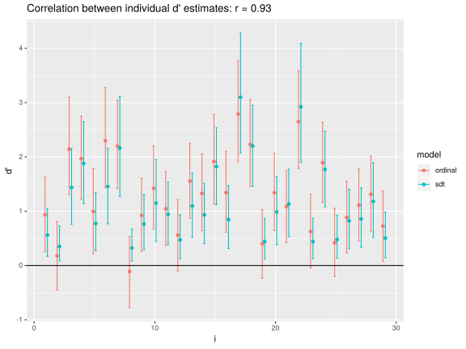

# Hierarchical ordinal regression models in bhsdtr

This document contains a short tutorial on fitting hierarchical
ordinal polytomous regression models using the bhsdtr package, but
there is more; It also contains some explanations, illustrated with
annotated code, of several issues related to ordinal models in
general, and Signal Detection Theory and Item Response Theory in
particular. If you are interested in SDT, IRT, or ordinal models in
general, perhaps you will find something useful here.
          
Anyway, it is now possible to fit hierarchical (more than two possible
values) ordinal regression models in bhsdtr by using order-preserving
link functions for the thresholds. If you have a bunch of Likert-type
items, or confidence ratings, or PAS ratings, or anything of this sort
in your data, then this model may suit your needs. To my knowledge
this is a new kind of hierarchical ordinal model that can be used to
estimate variability in the thresholds in a way that until recently
was not possible.

Ordinal polytomous variables are common in psychology, they are
usually analyzed by fitting a linear model, and all sorts of bad
things happen because of this, but only a few people seem to care. I
for one do not always care about this. We will not address this kind
of problems here, because we will analyze ordinal data using
(hierarchical) ordinal models.

We will use the following libraries and global variables:
                

```r
knitr::opts_chunk$set(echo=TRUE,results="show")
library(ggplot2)
library(bhsdtr)
library(Hmisc)
library(coda)
library(rstan)
options(mc.cores = parallel::detectCores())
rstan_options(auto_write = TRUE)
## This variable indicates if the fitted models can be loaded from disk
fresh_start = FALSE
sumfun = function(x)c(quantile(x, c(.025, .975)), mean(x))[c(1,3,2)]
```

First, we will consider an ordinal model which assumes that there is
an underlying normally distributed latent variable (e.g., an evidence
distribution in Signal Detection Theory, or a latent trait in an IRT
model) and when the value of this variable is above the latent
threshold *i*, but below the threshold *i + i*, the response *i + 1*
is generated. Threshold *0* is fixed at *-infinity* and threshold *K*
is fixed at *+infinity*, which means that there are *K-1* "regular"
thresholds and *K* possible responses. Since once we know the total
number of observations and the number of occurrences of *K - 1*
different responses, the number of occurrences of the only remaining
kind of response is known, there are *K - 1* degrees of freedom in
such data. The response variable is ordinal, and so the thresholds are
ordered. This is how this model looks like when the thresholds are
equidistant and centered at the mean of the latent variable
distribution (they do not have to be equidistant nor do they have to
be centered):


The number of parameters in this model matches the degrees of freedom
in the data, which means that the model is saturated, which means that
it always fits the data, but it does not mean that there is no
uncertainty associated with the estimates of its parameters.


We will be using this dataset...


```r
data(gabor)
```
        
... from which we will select two subsets of data for one condition,
one subset (*d1*) with only the "noise" trials and the other (*d2*)
with both the "noise" and the "signal" stimuli. We will also calculate
the response variable by combining the information about the stimulus,
the accuracy, and the rating.
                

```r
## r = 1 ~ absolutely clear image left, r = 4 ~ no experience left, r
## = 5 ~ no experience right, ... r = 8 ~ absolutely clear image right
gabor$r = combined_response(gabor$stim, gabor$rating, gabor$acc)
d1 = gabor[(gabor$duration == '32 ms') & (gabor$order == 'DECISION-RATING') & (gabor$stim == 0),]
d2 = gabor[(gabor$duration == '32 ms') & (gabor$order == 'DECISION-RATING'),]
```

We cannot naively model the effects in the thresholds, because the
thresholds have to stay ordered, and assuming, for example, that each
threshold has a normal distribution due to the effect of participants
would violate the ordering assumption.

To supplement our model with a hierarchical linear regression
structure the vector of the thresholds has to be translated to the
unconstrained vector gamma. The 'log_distance' order-preserving link
function is one solution to this problem, but other order-preserving
link functions are also implemented in the bhsdtr package. The choice
of the link function may sometimes be important, but, since we will
not introduce numerical predictors for the thresholds, we can choose
any link function which seems most convenient.

The log_distance function is convenient for our purposes because it is
simple, and because the elements of the gamma vector under this link
function are easy to interpret and may be directly related to simple
research questions. In particular, one of the elements of the gamma
vector under the log_distance link function, i.e., the middle
threshold, will soon become important. This link function represents
the main threshold/criterion directly as a free parameter (here
gamma[4], because K = 8, and 8 / 2 = 4); Every other criterion is
represented as log of distance between the criterion and the one
criterion adjacent to it which is closer to the main criterion. This
way the order is preserved, and each threshold *i* is associated with
the corresponding unconstrained element *i* of the gamma
vector. Random and fixed effects in the thresholds are represented as
(hierarchical) linear effects in gamma. The two representations are
isomorphic, which means that we can always translate between them if
we need to.


```r
link = 'log_distance'
```

To fit a model we have to aggregate the data as much as possible
without distorting the hierarchical structure (this makes the process
of sampling much faster), create the fixed- and random-effects lists,
and create the data structures and the model code required by
stan. Note that we introduce a new parameter - eta - which represents
the average internal value. If we are going to model all the
thresholds (gamma parameter vector) then this parameter is redundant,
because a constant shift in the thresholds is equivalent to the
opposite effect in eta. The bhsdtr package will automatically fix the
first element (here the only element) of the eta fixed effects vector
at 0, which will make this model identifiable.

First, we will fit a model which assumes that the pattern of the
thresholds is the same for all the participants, but the mean of the
latent distribution may differ across participants. If this makes
little sense to you please take a look at the picture of the ordinal
model with ordered thresholds and imagine that the underlying
distribution has a different mean for different participants.

Note that the two assumptions, i.e., that the thresholds are constant
across participants and latent means or samples are participant-, not
item-specific seem to be often accepted in applications of Item
Response Theory. This is also reflected in the IRT terminology:
thresholds are often called "item-parameters" and latent means or
samples are often called "person-parameters".


```r
fixed = list(eta = ~ 1, gamma = ~ 1)
random = list(list(group = ~ id, eta = ~ 1))
adata = aggregate_responses(d1, response = 'r', variables = 'id')
model = make_stan_model(random, model = 'ordinal', gamma_link = link)
sdata = make_stan_data(adata, fixed, random, model = 'ordinal', gamma_link = link)
if(fresh_start){
    fit = stan(model_code = model, data = sdata,
                   pars = c('eta_fixed', 'gamma_fixed', 'eta_random_1', 'eta_sd_1'),
                   init_r = .5,
                   iter = 5000,
                   chains = 4)
    saveRDS(fit, '~/windows/temp/ordinal_fit.rds')
}else{
    fit = readRDS('~/windows/temp/ordinal_fit.rds')
}
print(fit, probs = c(.025, .975), pars = c('eta_fixed', 'gamma_fixed'))
```

```
Inference for Stan model: 239f5edb9fbfb8db64a4ca28dc5e386a.
4 chains, each with iter=5000; warmup=2500; thin=1; 
post-warmup draws per chain=2500, total post-warmup draws=10000.

                  mean se_mean   sd  2.5% 97.5% n_eff Rhat
eta_fixed[1,1]   -0.03    0.04 4.95 -9.82  9.73 16801    1
gamma_fixed[1,1] -0.86    0.00 0.12 -1.11 -0.64 16225    1
gamma_fixed[2,1] -0.73    0.00 0.10 -0.92 -0.55 17312    1
gamma_fixed[3,1]  0.15    0.00 0.05  0.04  0.25 15983    1
gamma_fixed[4,1]  0.71    0.00 0.10  0.52  0.92  4331    1
gamma_fixed[5,1] -0.70    0.00 0.10 -0.91 -0.51 17648    1
gamma_fixed[6,1] -1.47    0.00 0.17 -1.83 -1.15 15419    1
gamma_fixed[7,1] -0.55    0.00 0.15 -0.85 -0.27 17252    1

Samples were drawn using NUTS(diag_e) at Sun Feb 16 11:38:13 2020.
For each parameter, n_eff is a crude measure of effective sample size,
and Rhat is the potential scale reduction factor on split chains (at 
convergence, Rhat=1).
```

Here is how the model fits (this is a maximum likelihood fit):
    


```r
sdt_ml_plot(model, adata, sdata)
```


So how do the "item-parameters" look like according to this model?


```r
crit = gamma_to_crit(as.data.frame(fit))
round(t(apply(crit, 2, sumfun)), 2)
```

```
                     2.5%       97.5%
criteria_fixed[1,1] -3.26 -3.02 -2.78
criteria_fixed[2,1] -2.33 -2.15 -1.97
criteria_fixed[3,1] -1.06 -0.92 -0.79
criteria_fixed[4,1]  0.53  0.72  0.92
criteria_fixed[5,1]  0.97  1.15  1.33
criteria_fixed[6,1]  1.19  1.37  1.55
criteria_fixed[7,1]  1.93  2.03  2.13
```

Note that the main criterion (gamma[4,1]) is *positive*, which makes
sense, since when the stimulus is of class "noise" the middle
criterion / threshold / average position of the thresholds is *to the
right* of the evidence distribution mean. Otherwise, as we will see
later, in this particular case, and perhaps also in many other similar
cases, these thresholds-as-"item-parameters" are probably meaningless.
                        
Now we will introduce the model which accounts for the
inter-individual differences in the pattern of the thresholds by
modelling the gamma random effects.
                                        

```r
adata0 = aggregate_responses(d1, response = 'r', variables = c('id'))
## The only element of the eta fixed effects vector will be automatically fixed at 0
fixed0 = list(eta = ~ 1, gamma = ~ 1)
## Each participant has a unique patterh of the thresholds
random0 = list(list(group = ~ id, gamma = ~ 1))
model0 = make_stan_model(random0, model = 'ordinal', gamma_link = link)
sdata0 = make_stan_data(adata0, fixed0, random0, model = 'ordinal', gamma_link = link)
if(fresh_start){
    fit0 = stan(model_code = model0, data = sdata0,
                pars = c('gamma_fixed', 'gamma_random_1', 'gamma_sd_1'),
                init_r = .5,
                iter = 5000,
                chains = 4)
    saveRDS(fit0, '~/windows/temp/ordinal_fit_0.rds')
}else{
    fit0 = readRDS('~/windows/temp/ordinal_fit_0.rds')
}
```


```r
print(fit0, probs = c(.025, .975), pars = c('gamma_fixed', 'gamma_sd_1'))
```

```
Inference for Stan model: 5e8ce6f1ba0470737c114b566c5ef550.
4 chains, each with iter=5000; warmup=2500; thin=1; 
post-warmup draws per chain=2500, total post-warmup draws=10000.

                  mean se_mean   sd  2.5% 97.5% n_eff Rhat
gamma_fixed[1,1] -1.17    0.01 0.43 -2.07 -0.36  2174    1
gamma_fixed[2,1] -0.51    0.00 0.18 -0.86 -0.14  4190    1
gamma_fixed[3,1]  0.06    0.00 0.14 -0.23  0.32  4201    1
gamma_fixed[4,1]  0.73    0.00 0.13  0.49  0.99  5256    1
gamma_fixed[5,1] -0.77    0.00 0.23 -1.25 -0.34  5515    1
gamma_fixed[6,1] -1.33    0.00 0.31 -1.95 -0.72  6705    1
gamma_fixed[7,1] -0.27    0.00 0.29 -0.74  0.43  3507    1
gamma_sd_1[1,1]   1.29    0.01 0.49  0.59  2.50  3134    1
gamma_sd_1[2,1]   0.69    0.00 0.20  0.36  1.13  5397    1
gamma_sd_1[3,1]   0.66    0.00 0.12  0.47  0.93  5745    1
gamma_sd_1[4,1]   0.60    0.00 0.12  0.40  0.86  4274    1
gamma_sd_1[5,1]   0.89    0.00 0.24  0.50  1.45  5498    1
gamma_sd_1[6,1]   0.82    0.01 0.36  0.21  1.66  4885    1
gamma_sd_1[7,1]   0.44    0.01 0.35  0.02  1.35  3022    1

Samples were drawn using NUTS(diag_e) at Sun Feb 16 11:39:55 2020.
For each parameter, n_eff is a crude measure of effective sample size,
and Rhat is the potential scale reduction factor on split chains (at 
convergence, Rhat=1).
```
        
Below we translate between the gamma and the criteria vectors (fixed
effects):


```r
s0 = as.data.frame(fit0)
crit0 = gamma_to_crit(s0, gamma_link = link)
```

Are the average thesholds different in the two models? Off course they
are, since the models are non-linear and averaging over anything that
affects any parameter of such models is a bad idea:


```r
crit_sm = as.data.frame(t(apply(crit, 2, sumfun)))
crit0_sm = as.data.frame(t(apply(crit0, 2, sumfun)))
crit_sm$model = 'fixed thresholds'
crit0_sm$model = "random thresholds"
crit_sm$threshold = 1:7 - .1
crit0_sm$threshold = 1:7 + .1
df = rbind(crit_sm, crit0_sm)
names(df)[1:3] = c('lo', 'mean', 'hi')
ggplot(df, aes(threshold, mean, group = model, color = model)) + geom_point() + geom_line() + geom_errorbar(aes(ymin = lo, ymax = hi))
```


The point and interval estimates of the thresholds based on the
thresholds-as-"item-parameters" model are severely biased. In
particular, the uncertainty in the estimates is severely
underestimated in this model. Was it obvious to you that the model
with no threshold random effects is such a bad idea?

Now we will fit a model which is similar to an SDT model, but there
will be two important differences. We will not assume that the answer
"signal" cannot be less likely for the stimulus "signal" than for the
stimulus "noise", i.e., we will not assume that *d'* must be
non-negative, and we will *not* assume that the pattern of the
thresholds is the same for "noise" and "signal" stimuli. If you know
your Signal Detection Theory well, this may seem to you like a
perverse idea. If that is the case, please bear with me.

In this model each participant may have two different sets of
thresholds, one for "noise" and one for "signal" stimuli. Since the
thresholds are represented as random effects, we will account for the
fact that "random" thresholds may be correlated; They have to be
correlated, because if some threshold is higher (lower) than the
sample average, then the threshold above (below) it may also be higher
(lower).

Here we introduce the effect of the stimulus on the gamma / thresholds
vector. We use separate intercepts and slopes parametrization (-1 +
stim), i.e., the thresholds are to be estimated for each stimulus class
instead of estimating them for "noise" stimuli and estimating the
difference in the thresholds between "signal" and "noise".


```r
fixed1 = list(eta = ~ 1, gamma = ~ -1 + stim)
random1 = list(list(group = ~ id, gamma = ~ -1 + stim))
## We have to make sure that stim is a factor for the separate
## intercepts and slopes parametrization to work as intended.
d2$stim = as.factor(d2$stim)
## Note that because for an ordinal model the stimulus variable (here
## the 'stim' variable) is not special, we have to include it in the
## additional variables vector
adata1 = aggregate_responses(d2, response = 'r', variables = c('id', 'stim'))
sdata1 = make_stan_data(adata1, fixed1, random1, model = 'ordinal', gamma_link = link)
model1 = make_stan_model(random1, model = 'ordinal', gamma_link = link)
if(fresh_start){
    fit1 = stan(model_code = model1, data = sdata1,
                pars = c('gamma_fixed', 'gamma_random_1', 'gamma_sd_1'),
                init_r = .5,
                iter = 5000,
                chains = 4)
    saveRDS(fit1, '~/windows/temp/ordinal_fit_1.rds')
}else{
    fit1 = readRDS('~/windows/temp/ordinal_fit_1.rds')
}
## We will not look at the eta parameter since it was fixed at 0
print(fit1, probs = c(.025, .975), pars = c('gamma_fixed', 'gamma_sd_1'))
```

```
Inference for Stan model: 5e8ce6f1ba0470737c114b566c5ef550.
4 chains, each with iter=5000; warmup=2500; thin=1; 
post-warmup draws per chain=2500, total post-warmup draws=10000.

                  mean se_mean   sd  2.5% 97.5% n_eff Rhat
gamma_fixed[1,1] -1.12    0.01 0.41 -1.97 -0.37  4109    1
gamma_fixed[1,2] -0.69    0.01 0.46 -1.50  0.38  6862    1
gamma_fixed[2,1] -0.52    0.00 0.18 -0.86 -0.16  6558    1
gamma_fixed[2,2] -1.13    0.00 0.37 -1.94 -0.48  8568    1
gamma_fixed[3,1]  0.06    0.00 0.13 -0.21  0.32  6326    1
gamma_fixed[3,2] -0.04    0.00 0.15 -0.33  0.27  9222    1
gamma_fixed[4,1]  0.72    0.00 0.13  0.49  0.98  7185    1
gamma_fixed[4,2] -0.59    0.00 0.13 -0.84 -0.34  9878    1
gamma_fixed[5,1] -0.75    0.00 0.23 -1.21 -0.32  9299    1
gamma_fixed[5,2] -0.38    0.00 0.15 -0.68 -0.10  8172    1
gamma_fixed[6,1] -1.35    0.00 0.28 -1.92 -0.79 11621    1
gamma_fixed[6,2] -0.81    0.00 0.17 -1.16 -0.50 10492    1
gamma_fixed[7,1] -0.24    0.00 0.29 -0.70  0.43  7222    1
gamma_fixed[7,2] -0.40    0.00 0.12 -0.65 -0.17 11742    1
gamma_sd_1[1,1]   1.29    0.01 0.50  0.60  2.51  4359    1
gamma_sd_1[1,2]   0.84    0.01 0.63  0.04  2.41  4994    1
gamma_sd_1[2,1]   0.68    0.00 0.19  0.36  1.10  7225    1
gamma_sd_1[2,2]   0.91    0.01 0.44  0.20  1.92  5314    1
gamma_sd_1[3,1]   0.63    0.00 0.11  0.45  0.86  8046    1
gamma_sd_1[3,2]   0.55    0.00 0.15  0.30  0.88  8664    1
gamma_sd_1[4,1]   0.59    0.00 0.11  0.40  0.83  5553    1
gamma_sd_1[4,2]   0.61    0.00 0.10  0.43  0.84  8412    1
gamma_sd_1[5,1]   0.89    0.00 0.24  0.51  1.44  7036    1
gamma_sd_1[5,2]   0.65    0.00 0.11  0.46  0.90  8999    1
gamma_sd_1[6,1]   0.75    0.00 0.33  0.16  1.50  5262    1
gamma_sd_1[6,2]   0.63    0.00 0.18  0.32  1.05  7038    1
gamma_sd_1[7,1]   0.47    0.01 0.34  0.03  1.29  4386    1
gamma_sd_1[7,2]   0.30    0.00 0.19  0.01  0.72  3870    1

Samples were drawn using NUTS(diag_e) at Sun Feb 16 11:41:59 2020.
For each parameter, n_eff is a crude measure of effective sample size,
and Rhat is the potential scale reduction factor on split chains (at 
convergence, Rhat=1).
```

Now we can translate between the gamma and the criteria vectors (fixed
effects = sample average) for each stimulus:
        


```r
s1 = as.data.frame(fit1)
crit1 = gamma_to_crit(s1, 1, gamma_link = link)
crit2 = gamma_to_crit(s1, 1, beta_index = 2, gamma_link = link)
sumfun = function(x)c(quantile(x, c(.025, .975)), mean(x))[c(1,3,2)]
crit1_sm = apply(crit1, 2, sumfun)
crit2_sm = apply(crit2, 2, sumfun)
```

The criteria for the stimulus class "noise" look like this:
        

```r
round(t(crit1_sm), 2)
```

```
      2.5%       97.5%
[1,] -1.82 -1.30 -0.89
[2,] -1.37 -0.95 -0.59
[3,] -0.66 -0.34 -0.06
[4,]  0.49  0.72  0.98
[5,]  0.92  1.21  1.55
[6,]  1.17  1.48  1.87
[7,]  1.83  2.31  3.10
```
        
and the criteria for the stimulus class "signal" look like this:
        

```r
round(t(crit2_sm), 2)
```

```
      2.5%       97.5%
[1,] -3.49 -2.48 -1.92
[2,] -2.38 -1.91 -1.52
[3,] -1.96 -1.56 -1.22
[4,] -0.84 -0.59 -0.34
[5,] -0.15  0.10  0.37
[6,]  0.29  0.56  0.84
[7,]  0.94  1.23  1.55
```

Note the difference between the main criterion (row 4). This
difference approximates *d'*. Even though, as we will later see, this
model does not correctly account for the effect of the stimulus
(because it violates the non-negativity assumption), we can still
recover this effect pretty well, because *d'* is equivalent to a
constant shift of all the thresholds in one predefined
direction. Shifting all the criteria to the right is equivalent to
shifting the underlying distribution of "latent values" (or evidence)
to the left, so we have to subtract the average position of the
criteria for the "signal" stimuli from the average position of the
criteria for the "noise" stimuli. Here is our first attempt:


```r
dprim1 = sumfun(s1[, 'gamma_fixed[4,1]'] - s1[, 'gamma_fixed[4,2]'])
round(dprim1, 2)
```

```
 2.5%       97.5% 
 0.95  1.31  1.68 
```

We will later see that this is our sample average *d'*, but it also
isn't.

In an SDT model we assume that the stimulus class affects *only* the
*d'* parameter, and that both criteria (gamma) and *d'* may differ
between the participants (or items, etc.). In bhsdtr *d'* is modelled
as *log(d') = delta*, which forces it to be non-negative. This is an
important assumption of Signal Detection Theory - if this assumption
is violated, for example, because of the response reversal in some
participants or conditions, then an SDT model is not valid and a
non-trivial generalization of SDT should be used instead (see the
bhsdtr preprint for a more detailed explanation and some
references). Otherwise, this is the same general hierarchical ordinal
regression model.


```r
fixed2 = list(delta = ~ 1, gamma = ~ 1)
random2 = list(list(group = ~ id, delta = ~ 1, gamma = ~ 1))
```
        
Because of the importance of the stimulus class ("noise", or 1, and
"signal", or 2) in SDT models we have to indicate which variable
represents this information ( aggregate_responses(..., stimulus =
'stim', ...) ).


```r
adata2 = aggregate_responses(d2, stimulus = 'stim', response = 'r', variables = c('id'))
sdata2 = make_stan_data(adata2, fixed2, random2, model = 'sdt', gamma_link = link)
model2 = make_stan_model(random2, model = 'sdt', gamma_link = link)
if(fresh_start){
    fit2 = stan(model_code = model2, data = sdata2,
                pars = c('delta_fixed', 'gamma_fixed', 'delta_sd_1', 'gamma_sd_1',
                         'delta_random_1', 'gamma_random_1',
                         ## We will need this for the plot_sdt_fit function
                         'counts_new'),
                init_r = .5,
                iter = 5000,
                chains = 4)
    saveRDS(fit2, '~/windows/temp/ordinal_fit_2.rds')
}else{
    fit2 = readRDS('~/windows/temp/ordinal_fit_2.rds')
}
print(fit2, probs = c(.025, .975), pars = c('delta_fixed', 'gamma_fixed', 'delta_sd_1', 'gamma_sd_1'))
```

```
Inference for Stan model: 4a70e45aa409298a13fc1510afb83180.
4 chains, each with iter=5000; warmup=2500; thin=1; 
post-warmup draws per chain=2500, total post-warmup draws=10000.

                  mean se_mean   sd  2.5% 97.5% n_eff Rhat
delta_fixed[1,1] -0.09    0.00 0.17 -0.45  0.23  3503    1
gamma_fixed[1,1] -1.00    0.01 0.30 -1.64 -0.46  2831    1
gamma_fixed[2,1] -0.64    0.00 0.15 -0.94 -0.34  4170    1
gamma_fixed[3,1]  0.03    0.00 0.13 -0.23  0.28  3502    1
gamma_fixed[4,1]  0.08    0.00 0.08 -0.07  0.24  5562    1
gamma_fixed[5,1] -0.51    0.00 0.15 -0.81 -0.21  4320    1
gamma_fixed[6,1] -0.90    0.00 0.14 -1.19 -0.65  5287    1
gamma_fixed[7,1] -0.38    0.00 0.12 -0.61 -0.15  7890    1
delta_sd_1[1,1]   0.78    0.00 0.16  0.52  1.15  3969    1
gamma_sd_1[1,1]   0.99    0.01 0.32  0.49  1.75  3479    1
gamma_sd_1[2,1]   0.56    0.00 0.15  0.30  0.89  5342    1
gamma_sd_1[3,1]   0.63    0.00 0.10  0.46  0.86  5407    1
gamma_sd_1[4,1]   0.37    0.00 0.07  0.25  0.52  4279    1
gamma_sd_1[5,1]   0.75    0.00 0.13  0.54  1.03  5587    1
gamma_sd_1[6,1]   0.55    0.00 0.14  0.31  0.86  5205    1
gamma_sd_1[7,1]   0.33    0.00 0.17  0.03  0.68  2897    1

Samples were drawn using NUTS(diag_e) at Sun Feb 16 11:44:45 2020.
For each parameter, n_eff is a crude measure of effective sample size,
and Rhat is the potential scale reduction factor on split chains (at 
convergence, Rhat=1).
```
        
So how well do the two *d'* estimates match? We can translate between
the delta and the *d'* parameters by using exponentiation. We have to
do this first, before doing anything else with the posterior samples,
because the exponential function is non-linear.


```r
s2 = as.data.frame(fit2)
dprim2 = sumfun(exp(s2[,'delta_fixed[1,1]']))
round(cbind(dprim1, dprim2), 2)
```

```
      dprim1 dprim2
2.5%    0.95   0.64
        1.31   0.92
97.5%   1.68   1.25
```
        
The estimates match poorly. Or do they? What about the individual *d'*
estimates? To calculate the individual shifts in the thresholds /
criteria we have to add the random effects to the fixed effect:


```r
dprim1i = (s1[['gamma_fixed[4,1]']] + s1[, grep('gamma_random_1\\[.+,4,1]', names(s1))]) -
    (s1[['gamma_fixed[4,2]']] + s1[, grep('gamma_random_1\\[.+,4,2]', names(s1))])
dprim1i = as.data.frame(t(apply(dprim1i, 2, sumfun)))
dprim2i = as.data.frame(t(apply(exp(s2[['delta_fixed[1,1]']] +
                                    s2[, grep('delta_random_1', names(s2))]), 2, sumfun)))
names(dprim1i) = names(dprim2i) = c('lo', 'mean', 'hi')
dprim1i$model = 'ordinal'
dprim1i$i = 1:nrow(dprim1i) - .1
dprim2i$model = 'sdt'
dprim2i$i = 1:nrow(dprim2i) + .1
ggplot(rbind(dprim1i, dprim2i), aes(i, mean, group = model, color = model)) +
    geom_point() + geom_errorbar(aes(ymin = lo, ymax = hi)) +
    geom_abline(intercept = 0, slope = 0) +
    ylab('d\'') +
    labs(title = sprintf('Correlation between individual d\' estimates: r = %.2f',
                         cor(dprim1i$mean, dprim2i$mean)))
```


        
The point and interval estimates match quite well, with some notable
exceptions. According to the ordinal model some credible intervals
around individual *d'* point estimates include 0 and one point
estimate is even below 0, which contradicts an important assumption of
the SDT model. We will address this issue later.

If the participant-specific *d'* estimates match, the sample average
*d'* should also match, right? Maybe the SDT model does not fit the
data well?


```r
plot_sdt_fit(fit2, adata2, c('id'), type = 'response', bw = F, verbose = F)
```


        
The SDT model seems to fit very well in a sense that the observed
distributions of responses are well within the 95% posterior
predictive intervals for each participant. However, this does not mean
much; an SDT model with multiple criteria is not saturated, so it does
not have to fit the data, but it does not leave too many degrees of
freedom in the data, so we can safely assume a priori that it will
usually fit the data well, regardless if it is true or not.

The discrepancy between the sample average *d'* estimates from both
models is not really a consequence of allowing for negative *d'*
values in the ordinal model. This discrepancy is a consequence of the
assumed distribution of individual shifts / *d'* values. In the
ordinal model we assumed that the shifts (*= d'*) are normally
distributed, whereas in the SDT model we assumed that *log(d')* are
normally distributed. We can see if the assumption that *log(d')* (or
*d'*) are normally distributed is approximately correct in our
dataset. First, let's take a look at participant-specific delta
estimates in the SDT model:


